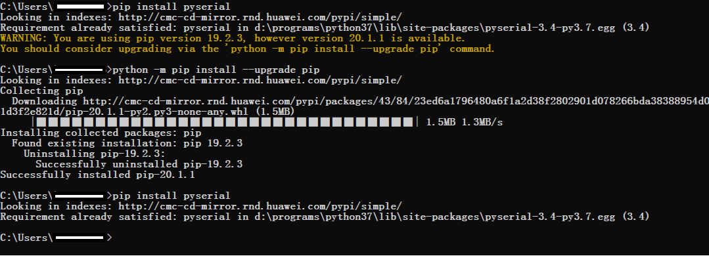
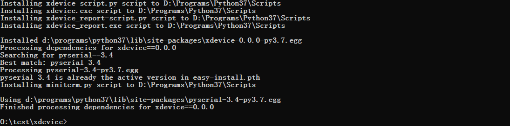

# 测试子系统<a name="ZH-CN_TOPIC_0000001050883540"></a>

## 简介<a name="section7375710115617"></a>

开发过程采用测试驱动开发模式，开发者基于系统新增特性可以通过开发者自己开发用例保证，对于系统已有特性的修改，也可通过修改项目中原有自测试用例保证，开发者自测试旨在帮助开发者在开发阶段就能开发出高质量代码

## 目录<a name="section102031353175317"></a>

**表 1**  开发者自测试工具源代码目录结构

<a name="table2977131081412"></a>
<table><thead align="left"><tr id="row7977610131417"><th class="cellrowborder" valign="top" width="33.879999999999995%" id="mcps1.2.3.1.1"><p id="p18792459121314"><a name="p18792459121314"></a><a name="p18792459121314"></a>名称</p>
</th>
<th class="cellrowborder" valign="top" width="66.12%" id="mcps1.2.3.1.2"><p id="p77921459191317"><a name="p77921459191317"></a><a name="p77921459191317"></a>描述</p>
</th>
</tr>
</thead>
<tbody><tr id="row17977171010144"><td class="cellrowborder" valign="top" width="33.879999999999995%" headers="mcps1.2.3.1.1 "><p id="p2793159171311"><a name="p2793159171311"></a><a name="p2793159171311"></a>developertest</p>
</td>
<td class="cellrowborder" valign="top" width="66.12%" headers="mcps1.2.3.1.2 "><p id="p879375920132"><a name="p879375920132"></a><a name="p879375920132"></a>开发自测试框架</p>
</td>
</tr>
<tr id="row259142201312"><td class="cellrowborder" valign="top" width="33.879999999999995%" headers="mcps1.2.3.1.1 "><p id="p640585013134"><a name="p640585013134"></a><a name="p640585013134"></a>developertest/src</p>
</td>
<td class="cellrowborder" valign="top" width="66.12%" headers="mcps1.2.3.1.2 "><p id="p10406450131319"><a name="p10406450131319"></a><a name="p10406450131319"></a>测试框架源码</p>
</td>
</tr>
<tr id="row1188919458130"><td class="cellrowborder" valign="top" width="33.879999999999995%" headers="mcps1.2.3.1.1 "><p id="p115448132141"><a name="p115448132141"></a><a name="p115448132141"></a>developertest/src/core</p>
</td>
<td class="cellrowborder" valign="top" width="66.12%" headers="mcps1.2.3.1.2 "><p id="p1254413131146"><a name="p1254413131146"></a><a name="p1254413131146"></a>测试执行器</p>
</td>
</tr>
<tr id="row6978161091412"><td class="cellrowborder" valign="top" width="33.879999999999995%" headers="mcps1.2.3.1.1 "><p id="p37931659101311"><a name="p37931659101311"></a><a name="p37931659101311"></a>developertest/src/core/build</p>
</td>
<td class="cellrowborder" valign="top" width="66.12%" headers="mcps1.2.3.1.2 "><p id="p6793059171318"><a name="p6793059171318"></a><a name="p6793059171318"></a>自测试用例编译</p>
</td>
</tr>
<tr id="row6978201031415"><td class="cellrowborder" valign="top" width="33.879999999999995%" headers="mcps1.2.3.1.1 "><p id="p1738210441049"><a name="p1738210441049"></a><a name="p1738210441049"></a>developertest/src/core/command</p>
</td>
<td class="cellrowborder" valign="top" width="66.12%" headers="mcps1.2.3.1.2 "><p id="p1629020401941"><a name="p1629020401941"></a><a name="p1629020401941"></a>对用户输入的命令行处理</p>
</td>
</tr>
<tr id="row1596814581415"><td class="cellrowborder" valign="top" width="33.879999999999995%" headers="mcps1.2.3.1.1 "><p id="p158313363613"><a name="p158313363613"></a><a name="p158313363613"></a>developertest/src/core/config</p>
</td>
<td class="cellrowborder" valign="top" width="66.12%" headers="mcps1.2.3.1.2 "><p id="p12969358749"><a name="p12969358749"></a><a name="p12969358749"></a>测试框架配置管理</p>
</td>
</tr>
<tr id="row175618551244"><td class="cellrowborder" valign="top" width="33.879999999999995%" headers="mcps1.2.3.1.1 "><p id="p73791172718"><a name="p73791172718"></a><a name="p73791172718"></a>developertest/src/core/driver</p>
</td>
<td class="cellrowborder" valign="top" width="66.12%" headers="mcps1.2.3.1.2 "><p id="p107568558416"><a name="p107568558416"></a><a name="p107568558416"></a>测试框架驱动执行器</p>
</td>
</tr>
<tr id="row114431614115"><td class="cellrowborder" valign="top" width="33.879999999999995%" headers="mcps1.2.3.1.1 "><p id="p1644216201111"><a name="p1644216201111"></a><a name="p1644216201111"></a>developertest/src/core/resource</p>
</td>
<td class="cellrowborder" valign="top" width="66.12%" headers="mcps1.2.3.1.2 "><p id="p15441116171113"><a name="p15441116171113"></a><a name="p15441116171113"></a>测试框架配置文件</p>
</td>
</tr>
<tr id="row16289143217239"><td class="cellrowborder" valign="top" width="33.879999999999995%" headers="mcps1.2.3.1.1 "><p id="p82908327236"><a name="p82908327236"></a><a name="p82908327236"></a>developertest/src/core/testcase</p>
</td>
<td class="cellrowborder" valign="top" width="66.12%" headers="mcps1.2.3.1.2 "><p id="p129013219235"><a name="p129013219235"></a><a name="p129013219235"></a>测试用例管理</p>
</td>
</tr>
<tr id="row1403172313113"><td class="cellrowborder" valign="top" width="33.879999999999995%" headers="mcps1.2.3.1.1 "><p id="p5403202371115"><a name="p5403202371115"></a><a name="p5403202371115"></a>developertest/src/core/common.py</p>
</td>
<td class="cellrowborder" valign="top" width="66.12%" headers="mcps1.2.3.1.2 "><p id="p84031423201110"><a name="p84031423201110"></a><a name="p84031423201110"></a>测试框架公共操作</p>
</td>
</tr>
<tr id="row1688681821114"><td class="cellrowborder" valign="top" width="33.879999999999995%" headers="mcps1.2.3.1.1 "><p id="p4886718121111"><a name="p4886718121111"></a><a name="p4886718121111"></a>developertest/src/core/constants.py</p>
</td>
<td class="cellrowborder" valign="top" width="66.12%" headers="mcps1.2.3.1.2 "><p id="p10886151811115"><a name="p10886151811115"></a><a name="p10886151811115"></a>测试框架全局常量</p>
</td>
</tr>
<tr id="row13247163492"><td class="cellrowborder" valign="top" width="33.879999999999995%" headers="mcps1.2.3.1.1 "><p id="p710851611910"><a name="p710851611910"></a><a name="p710851611910"></a>developertest/src/core/exception.py</p>
</td>
<td class="cellrowborder" valign="top" width="66.12%" headers="mcps1.2.3.1.2 "><p id="p112471431895"><a name="p112471431895"></a><a name="p112471431895"></a>测试框架异常定义</p>
</td>
</tr>
<tr id="row1392104161718"><td class="cellrowborder" valign="top" width="33.879999999999995%" headers="mcps1.2.3.1.1 "><p id="p292154131715"><a name="p292154131715"></a><a name="p292154131715"></a>developertest/src/core/utils.py</p>
</td>
<td class="cellrowborder" valign="top" width="66.12%" headers="mcps1.2.3.1.2 "><p id="p139224117173"><a name="p139224117173"></a><a name="p139224117173"></a>测试框架工具方法</p>
</td>
</tr>
<tr id="row43471438181714"><td class="cellrowborder" valign="top" width="33.879999999999995%" headers="mcps1.2.3.1.1 "><p id="p1134883851719"><a name="p1134883851719"></a><a name="p1134883851719"></a>developertest/src/main</p>
</td>
<td class="cellrowborder" valign="top" width="66.12%" headers="mcps1.2.3.1.2 "><p id="p7348123861711"><a name="p7348123861711"></a><a name="p7348123861711"></a>测试框架平台</p>
</td>
</tr>
<tr id="row144751036111712"><td class="cellrowborder" valign="top" width="33.879999999999995%" headers="mcps1.2.3.1.1 "><p id="p16475163681716"><a name="p16475163681716"></a><a name="p16475163681716"></a>developertest/src/main/__main__.py</p>
</td>
<td class="cellrowborder" valign="top" width="66.12%" headers="mcps1.2.3.1.2 "><p id="p11475103641712"><a name="p11475103641712"></a><a name="p11475103641712"></a>测试框架内部入口</p>
</td>
</tr>
<tr id="row11435113411716"><td class="cellrowborder" valign="top" width="33.879999999999995%" headers="mcps1.2.3.1.1 "><p id="p4435153416170"><a name="p4435153416170"></a><a name="p4435153416170"></a>developertest/example</p>
</td>
<td class="cellrowborder" valign="top" width="66.12%" headers="mcps1.2.3.1.2 "><p id="p643523491711"><a name="p643523491711"></a><a name="p643523491711"></a>测试框架demo用例</p>
</td>
</tr>
<tr id="row988116194289"><td class="cellrowborder" valign="top" width="33.879999999999995%" headers="mcps1.2.3.1.1 "><p id="p7881161913283"><a name="p7881161913283"></a><a name="p7881161913283"></a>developertest/third_party</p>
</td>
<td class="cellrowborder" valign="top" width="66.12%" headers="mcps1.2.3.1.2 "><p id="p58815196285"><a name="p58815196285"></a><a name="p58815196285"></a>测试框架依赖第三方组件适配</p>
</td>
</tr>
<tr id="row11235133231718"><td class="cellrowborder" valign="top" width="33.879999999999995%" headers="mcps1.2.3.1.1 "><p id="p19235153291712"><a name="p19235153291712"></a><a name="p19235153291712"></a>developertest/BUILD.gn</p>
</td>
<td class="cellrowborder" valign="top" width="66.12%" headers="mcps1.2.3.1.2 "><p id="p19235143291715"><a name="p19235143291715"></a><a name="p19235143291715"></a>测试子系统编译配置</p>
</td>
</tr>
<tr id="row153133019174"><td class="cellrowborder" valign="top" width="33.879999999999995%" headers="mcps1.2.3.1.1 "><p id="p163153019174"><a name="p163153019174"></a><a name="p163153019174"></a>developertest/start.bat</p>
</td>
<td class="cellrowborder" valign="top" width="66.12%" headers="mcps1.2.3.1.2 "><p id="p194133051713"><a name="p194133051713"></a><a name="p194133051713"></a>开发者自测试入口（Windows）</p>
</td>
</tr>
<tr id="row6640152712173"><td class="cellrowborder" valign="top" width="33.879999999999995%" headers="mcps1.2.3.1.1 "><p id="p2641202751712"><a name="p2641202751712"></a><a name="p2641202751712"></a>developertest/start.sh</p>
</td>
<td class="cellrowborder" valign="top" width="66.12%" headers="mcps1.2.3.1.2 "><p id="p86419276175"><a name="p86419276175"></a><a name="p86419276175"></a>开发者自测试入口（Linux）</p>
</td>
</tr>
</tbody>
</table>

## 约束<a name="section87444710110"></a>

测试工具环境依赖

1.  python版本\>=3.7.5
2.  NFS版本\>=V4
3.  运行操作系统：Windows版本\>=Win10，Linux为Ubuntu18.04

## 安装<a name="section1347156474"></a>

依赖python环境：

需要本地的python安装串口插件pyserial，在shell界面执行安装命令pip intall pyserial，安装成功如下图



## 编写测试用例<a name="section125411936102918"></a>

-   自测试用例规范
    -   命名规范

        测试用例源文件名称和测试套内容保持一致，测试套与用例之间关系1:N，测试套与测试源文件之间关系1:1，每个源文件全局唯一，格式：\[特性\]\_\[功能\]\_\[子功能1\]\_\[子功能1.1\]，子功能支持向下细分。

        文件命名采用大驼峰方式命名，以Test结尾，如demo用例：developertest/example/cxx\_demo

    -   用例编码规范

        开发者自测试用例原则上与特性代码编码规范保持一致，另外需要添加必要的用例描述信息，详见[•自测试用例模板](#li2069415903917)

    -   测试用例编译配置规范

        用例采用GN方式编译，配置遵循本开源项目的编译指导[使用](zh-cn_topic_0000001051580775.md)


-   <a name="li2069415903917"></a>自测试用例模板

    详见测试demo用例developertest/example/cxx\_demo/test/unittest/common/calc\_subtraction\_test.cpp

    > **说明：** 
    >Feature: 被测特性的描述
    >Function: 被测特性功能
    >SubFunction：被测特性子功能
    >FunctionPoints：被测的功能点
    >EnvConditions：被测特性的环境与被测条件
    >CaseDescription：测试用例描述
    >step：测试复杂逻辑时注明用例执行的步骤

-   自测试用例目录规划

    ```
    subsystem（子系统，系统组件）
    ├── module（模块）
    │     └── test（模块测试目录）
    │             └── unittest（单元测试）
    │                    ├── common（公共用例）
    │                    ├── liteos（仅liteos核用例）
    │                    └── linux（仅Linux核用例）
    │             └── moduletest（模块测试）
    │                    ├── common
    │                    ├── liteos
    │                    └── linux
    └── test（子系统测试目录）
           └── unittest（单元测试）
                 ├── common
                 ├── liteos
                 ├── linux
           └── moduletest（模块测试）
                 ├── common
                 ├── liteos
                 ├── linux
    
    ```

    > **说明：** 
    >其中liteos和Linux仅不同设备形态举例，对于同一特性在不同开发板上，如果用例没有差异，则用例放置common目录下，如果同一特性，用例区分不同设备形态，可能包含内核差异，芯片平台差异，则用例以目录区分

-   编写自测试用例步骤
    1.  添加用例文件头注释说明
    2.  引用gtest头文件和ext命名空间
    3.  添加被测试类头文件
    4.  定义测试套（测试类）
    5.  实现该测试套具体的测试用例，包括用例注释和用例逻辑实现
    6.  编写用例编译配置

        > **说明：** 
        >\*样例参考：developertest/example/cxx\_demo/test/unittest/common/calc\_subtraction\_test.cpp
        >注意点如下：
        >a、SetUp & TearDown是针对该测试套下每条用例执行前和执行后的处理逻辑
        >b、SetUpTestCase & TearDownTestCase是针对该测试套下所有用例执行前和执行后的处理逻辑
        >c、HWTEST的使用：特点：只适合做简单测试（执行不依赖Setup & Teardown）缺点：多个测试场景需要相同数据配置的情况不适用，测试用例之间可能相互影响，不具备独立性
        >d、使用printf函数打印日志


-   编写用例编译文件
    -   定义用例编译构建目标
        1.  添加用例编译文件头注释信息
        2.  导入用例编译模板文件
        3.  指定用例文件输出路径
        4.  配置用例编译依赖包含目录
        5.  指定用例编译目标输出的用例执行文件名称
        6.  编写具体的用例编译脚本（添加需要参与编译的源文件、配置和依赖 ）
        7.  对目标用例文件进行条件分组（分组名称固定为：unittest/moduletest\)

    -   如果存在多个测试套，定义公共编译配置
    -   将测试用例添加到构建系统中

        > **说明：** 
        >\*样例参考：developertest/example/cxx\_demo/test/unittest/common/BUILD.gn


-   测试用例级别定义
    -   基本（Level1）:<1s
    -   重要（Level2）:<10s
    -   一般（Level3）:<5min
    -   生僻（Level4）:\>5min


## 使用测试框架<a name="section75882026185016"></a>

-   安装xdevice基础框架
    1.  以Windows环境为例，打开xdevice安装目录：test\\xdevice
    2.  打开控制台窗口，执行如下命令

        ```
        python setup.py install
        ```

    3.  安装成功如下图

        


-   修改xdevice基础框架配置

    文件：xdevice/config/user\_config.xml

    1.  \[device\]    \# 配置标签为ipcamera的串口信息，COM口和波特率，例如

        ```
        <device type="com" label="ipcamera">
            <serial>
                <com>COM1</com>
                <type>cmd</type>
                <baund_rate>115200</baund_rate>
                <data_bits>8</data_bits>
                <stop_bits>1</stop_bits>
                <timeout>1</timeout>
            </serial>
        </device>
        ```


-   修改developertest组件配置

    文件：resource/config/user\_config.xml

    1.  \[test\_cases\]    \# 指定测试用例的输出路径，编译输出目录，例如

        ```
        <test_cases>
            <dir>S:\out\ipcamera_hi3518ev300_liteos_a\test</dir>
        </test_cases>
        ```

    2.  \[NFS\]    \# 指定NFS的映射路径，host\_dir为PC侧的NFS目录，board\_dir为板侧创建的目录，例如

        ```
        <NFS>
            <host_dir>D:\nfs</host_dir>
            <board_dir>user</board_dir>
        </NFS>
        ```


-   执行自测试用例前的环境检查
    -   系统镜像与文件系统已烧录进开发板，开发板上系统正常运行，在系统模式下，如shell登录时设备提示符OHOS\#
    -   开发主机和开发板串口连接正常，网口连接正常
    -   开发主机IP与开发板IP处在同一小网网段，相互可以ping通
    -   开发主机侧创建空目录用于开发板通过NFS挂载测试用例，并且NFS服务启动正常

-   运行测试套
    -   启动测试框架
        1.  Windows环境启动测试框架

            ```
            start.bat
            ```

        2.  Linux环境启动测试框架

            ```
            ./strat.sh
            ```


    -   设备形态选择

        根据实际的开发板选择，设备形态配置：developertest/src/core/resource/config/framework\_config.xml

    -   执行测试指令
        1.  执行测试指令示例，其中-t ut为必选，-ss和-tm为可选字段

            ```
            run -t ut -ss test -tm example
            ```

        2.  参数说明：指定参数可以执行特定特性、模块对应的测试套

            ```
            usage: __main__.py [-h] [-p PRODUCTFORM] [-t [TESTTYPE [TESTTYPE ...]]]
                [-ss SUBSYSTEM] [-tm TESTMODULE] [-ts TESTSUIT]
                [-tc TESTCASE] [-tl TESTLEVEL] [-os TARGET_OS_NAME]
                [-bv BUILD_VARIANT] [-b [BUILD [BUILD ...]]]
                [-cov COVERAGE] [-tf TESTFILE] [-res RESOURCE]
                [-sn DEVICE_SN] [-c CONFIG] [-rp REPORTPATH] [-e EXECTYPE]
                [-td TEST_DRIVER]
                action Specify test para.positional arguments:
                    action                Specify action
            
            optional arguments:
                -h, --help            show this help message and exit
                -p PRODUCTFORM, --productform PRODUCTFORM    Specified product form
                -t [TESTTYPE [TESTTYPE ...]], --testtype [TESTTYPE [TESTTYPE ...]]
                    Specify test type(UT,MST,ST,PERF,ALL)
                -ss SUBSYSTEM, --subsystem SUBSYSTEM    Specify test subsystem
                -tm TESTMODULE, --testmodule TESTMODULE    Specified test module
                -ts TESTSUIT, --testsuit TESTSUIT    Specify test suit
                -tc TESTCASE, --testcase TESTCASE    Specify test case
                -tl TESTLEVEL, --testlevel TESTLEVEL    Specify test level
                -bv BUILD_VARIANT, --build_variant BUILD_VARIANT    Specify build variant(release,debug)
                -b [BUILD [BUILD ...]], --build [BUILD [BUILD ...]]
                    Specify build values(version,testcase)
                -tf TESTFILE, --testfile TESTFILE    Specify test suites list file
                -res RESOURCE, --resource RESOURCE    Specify test resource
                -sn DEVICE_SN, --device_sn DEVICE_SN    Specify device serial number
                -c CONFIG, --config CONFIG    Specify test config file
                -rp REPORTPATH, --reportpath REPORTPATH    Specify test report path
                -e EXECTYPE, --exectype EXECTYPE    Specify test execute type
                -td TEST_DRIVER, --testdriver TEST_DRIVER    Specify test driver id
            ```


-   测试框架帮助
    -   帮助指令，用于查询测试平台支持哪些测试指令

        ```
        help
        ```


## 测试结果与日志<a name="section414715805819"></a>

-   通过在测试框架中执行测试指令，即可以生成测试日志和测试报告
-   测试结果
    -   测试用例的结果会直接显示在控制台上，执行一次的测试结果根路径如下：

        ```
        reports/xxxx-xx-xx-xx-xx-xx
        ```

    -   测试用例格式化结果

        ```
        result/
        ```

    -   测试用例日志

        ```
        log/plan_log_xxxx-xx-xx-xx-xx-xx.log
        ```

    -   测试报告概率

        ```
        summary_report.html
        ```

    -   测试报告详情

        ```
        details_report.html
        ```


-   测试框架日志

    ```
    reports/platform_log_xxxx-xx-xx-xx-xx-xx.log
    ```

-   最近一次测试报告

    ```
    reports/latest
    ```


## 涉及仓<a name="section6299103515474"></a>

test\_developertest

test\_xdevice

