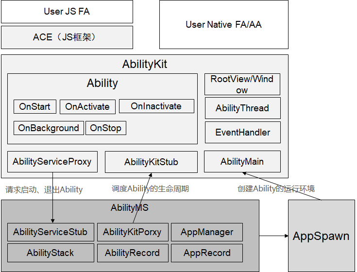
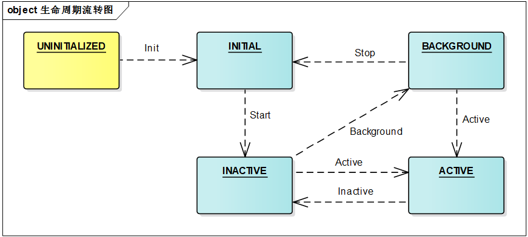
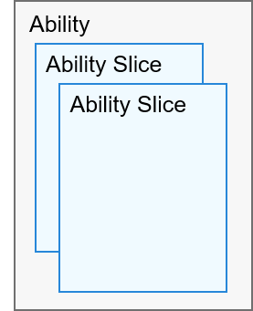
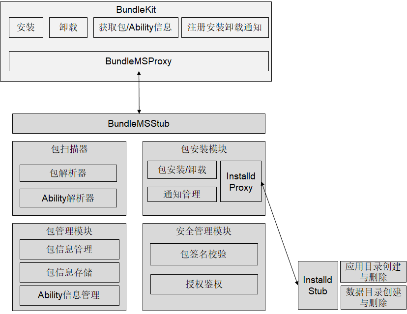
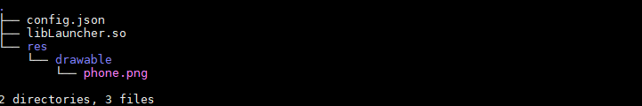

# 用户程序框架子系统<a name="ZH-CN_TOPIC_0000001052619284"></a>

## 简介<a name="section11660541593"></a>

用户程序框架子系统包含两个大的模块：元能力子系统和包管理子系统。

**元能力子系统**，是OpenHarmony为开发者提供的一套开发OpenHarmony应用的开发框架。元能力子系统由如下模块组成：

**图1**  元能力子系统框架图



Ability是应用所具备的能力的抽象，一个应用可以包含一个或多个Ability。Ability分为两种类型：FA（Feature Ability）和AA（Atomic Ability）。

-   **FA**：由三方基于元能力框架开发的、实现单一功能的有UI界面的程序实体，用于支持与用户交互的能力。一个Page实例可以包含一组相关页面，每个页面用一个AbilitySlice实例表示。Page模板是Feature Ability唯一支持的模板。用户可以基于JavaScript语言开发FA，也可以基于C/C++语言开发FA。

    -   Page模板的Ability的生命周期流转图

    **图2**  Ability生命周期流转图

    Page模板的Ability生命周期各状态解析

    -   **UNINITIALIZED**：未初始状态，为临时状态，Ability创建后会直接调用Init初始化，进入INITIAL状态；

    -   **INITIAL**：初始化状态，也表示停止状态，表示当前Ability未运行，调用Start后进入INACTIVE，同时回调开发者的OnSatrt生命周期回调；

    -   **INACTIVE**：未激活状态，表示当前窗口已显示但是无焦点状态，由于Window暂未支持焦点的概念，当前状态与ACTIVE一致。调用Active后进入ACTIVE，同时回调开发者的OnActive生命周期回调；调用Background后进入BACKGROUND，同时回调开发者的OnBackground生命周期回调；

    -   **ACTIVE**：前台激活状态，表示当前窗口已显示，并获取焦点。调用Inactive后进入INACTIVE；

    -   **BACKGROUND**: 后台状态，表示当前Ability退到后台。调用Active后进入ACTIVE，同时回调开发者的OnActive生命周期回调；调用Stop后进入INITIAL，同时回调开发者的OnStop生命周期回调；

    -   **AbilitySlice**

        一个使用Page模板的Ability由AbilitySlice构成，AbilitySlice是单个页面及其控制逻辑的总和。一个Page可以包含多个AbilitySlice，此时，这些页面提供的业务能力应当是高度相关的。Page模板的Ability与AbilitySlice的关系如下图：

        **图3 **Ability与AbilitySlice的关系图

        


-   **AA**：由三方基于元能力框架开发的、实现单一功能的无UI界面的支持后台任务的程序实体。AA与FA的区别是，AA无UI界面。仅对系统服务有依赖关系，AA之间不存在依赖关系 。Service模板是AA支持的模板。
-   **注册Ability**

    Ability的模板通过在清单文件中注册时指定。如下所示，开发者可以配置Ability元素的type属性，其取值page、service分别代表Page模板、Service模板。

    ```
    "module": {
           ......
            "abilities": [
                {
    		"name": "default",
    		"type": "pages",
                    "label": "sdfasf"
                }
            ], ’
          ......
     }
    ```


-   **AbilityKit**：元能力的开发框架，运行在开发者的应用程序进程中，和AbilityMs通过IPC通信，开发者基于该框架开发自己的Ability。

-   **AbilityMs**：元能力运行管理服务，元能力生命周期的调度统一由AbilityMs管理。
-   **AppSpawn：**进程孵化器，元能力进程由AppSpawn负责孵化并拉起。

**包管理子系统**，是OpenHarmony为开发者提供的安装包管理框架。包管理子系统的由如下模块组成：

**图4**  包管理子系统框架图



-   **包扫描器**：用来解析本地预制或者安装的安装包，提取里面的各种信息，供管理子模块进行管理，持久化

-   **包安装子模块**：安装，卸载，升级一个包；Installed一个单独进程的用于创建删除安装目录，具有较高的权限。

-   **包管理子模块**：管理安装包相关的信息

-   **安全子模块**：签名检查、权限授予、权限管理

## 目录<a name="section1464106163817"></a>

轻量用户程序框架子系统源代码目录结构如下图所示：

**表 1**  轻量用户程序用户程序框架子系统源代码目录结构

<a name="table2977131081412"></a>
<table><thead align="left"><tr id="row7977610131417"><th class="cellrowborder" valign="top" width="36.18%" id="mcps1.2.3.1.1"><p id="p18792459121314"><a name="p18792459121314"></a><a name="p18792459121314"></a>名称</p>
</th>
<th class="cellrowborder" valign="top" width="63.82%" id="mcps1.2.3.1.2"><p id="p77921459191317"><a name="p77921459191317"></a><a name="p77921459191317"></a>描述</p>
</th>
</tr>
</thead>
<tbody><tr id="row17977171010144"><td class="cellrowborder" valign="top" width="36.18%" headers="mcps1.2.3.1.1 "><p id="p2793159171311"><a name="p2793159171311"></a><a name="p2793159171311"></a>foundation/aafwk/frameworks/kits/ability_lite</p>
</td>
<td class="cellrowborder" valign="top" width="63.82%" headers="mcps1.2.3.1.2 "><p id="p879375920132"><a name="p879375920132"></a><a name="p879375920132"></a>元能力框架核心代码</p>
</td>
</tr>
<tr id="row6978161091412"><td class="cellrowborder" valign="top" width="36.18%" headers="mcps1.2.3.1.1 "><p id="p0780163617556"><a name="p0780163617556"></a><a name="p0780163617556"></a>foundation/aafwk/frameworks/kits/content_lite</p>
</td>
<td class="cellrowborder" valign="top" width="63.82%" headers="mcps1.2.3.1.2 "><p id="p6793059171318"><a name="p6793059171318"></a><a name="p6793059171318"></a>元能力之间通信的实体</p>
</td>
</tr>
<tr id="row6978201031415"><td class="cellrowborder" valign="top" width="36.18%" headers="mcps1.2.3.1.1 "><p id="p991413565611"><a name="p991413565611"></a><a name="p991413565611"></a>foundation/aafwk/frameworks/kits/tools_lite</p>
</td>
<td class="cellrowborder" valign="top" width="63.82%" headers="mcps1.2.3.1.2 "><p id="p0793185971316"><a name="p0793185971316"></a><a name="p0793185971316"></a>元能力调测工具</p>
</td>
</tr>
<tr id="row1897841071415"><td class="cellrowborder" valign="top" width="36.18%" headers="mcps1.2.3.1.1 "><p id="p20749155715720"><a name="p20749155715720"></a><a name="p20749155715720"></a>foundation/aafwk/interfaces/innerkits/abilitykit_lite</p>
</td>
<td class="cellrowborder" valign="top" width="63.82%" headers="mcps1.2.3.1.2 "><p id="p14793959161317"><a name="p14793959161317"></a><a name="p14793959161317"></a>元能力框架对外接口</p>
</td>
</tr>
<tr id="row965423512587"><td class="cellrowborder" valign="top" width="36.18%" headers="mcps1.2.3.1.1 "><p id="p12654103516589"><a name="p12654103516589"></a><a name="p12654103516589"></a>foundation/aafwk/interfaces/innerkits/abilitymgr_lite</p>
</td>
<td class="cellrowborder" valign="top" width="63.82%" headers="mcps1.2.3.1.2 "><p id="p12658142611466"><a name="p12658142611466"></a><a name="p12658142611466"></a>元能力运行管理服务对外接口</p>
</td>
</tr>
<tr id="row673463115813"><td class="cellrowborder" valign="top" width="36.18%" headers="mcps1.2.3.1.1 "><p id="p127343312581"><a name="p127343312581"></a><a name="p127343312581"></a>foundation/aafwk/interfaces/innerkits/intent_lite</p>
</td>
<td class="cellrowborder" valign="top" width="63.82%" headers="mcps1.2.3.1.2 "><p id="p191041469363"><a name="p191041469363"></a><a name="p191041469363"></a>元能力之间通信的实体对外接口</p>
</td>
</tr>
<tr id="row164593855812"><td class="cellrowborder" valign="top" width="36.18%" headers="mcps1.2.3.1.1 "><p id="p1864523835812"><a name="p1864523835812"></a><a name="p1864523835812"></a>foundation/aafwk/services/abilitymgr_lite</p>
</td>
<td class="cellrowborder" valign="top" width="63.82%" headers="mcps1.2.3.1.2 "><p id="p4645133805811"><a name="p4645133805811"></a><a name="p4645133805811"></a>元能力运行管理服务</p>
</td>
</tr>
<tr id="row1869744111581"><td class="cellrowborder" valign="top" width="36.18%" headers="mcps1.2.3.1.1 "><p id="p10698114117583"><a name="p10698114117583"></a><a name="p10698114117583"></a>foundation/appexecfwk/interfaces/innerkits/appexecfwk_lite</p>
</td>
<td class="cellrowborder" valign="top" width="63.82%" headers="mcps1.2.3.1.2 "><p id="p1169814112585"><a name="p1169814112585"></a><a name="p1169814112585"></a>用户程序运行的包信息、元能力信息、异步事件处理等基本接口</p>
</td>
</tr>
<tr id="row106931420217"><td class="cellrowborder" valign="top" width="36.18%" headers="mcps1.2.3.1.1 "><p id="p86931748213"><a name="p86931748213"></a><a name="p86931748213"></a>foundation/appexecfwk/interfaces/innerkits/bundlemgr_lite</p>
</td>
<td class="cellrowborder" valign="top" width="63.82%" headers="mcps1.2.3.1.2 "><p id="p12693148215"><a name="p12693148215"></a><a name="p12693148215"></a>用户程序包管理服务对外接口</p>
</td>
</tr>
<tr id="row58381913213"><td class="cellrowborder" valign="top" width="36.18%" headers="mcps1.2.3.1.1 "><p id="p11839171152117"><a name="p11839171152117"></a><a name="p11839171152117"></a>foundation/appexecfwk/kits/appkit_lite</p>
</td>
<td class="cellrowborder" valign="top" width="63.82%" headers="mcps1.2.3.1.2 "><p id="p158391810217"><a name="p158391810217"></a><a name="p158391810217"></a>用户程序运行的包信息、元能力信息、异步事件处理机制的实现逻辑</p>
</td>
</tr>
<tr id="row841015115218"><td class="cellrowborder" valign="top" width="36.18%" headers="mcps1.2.3.1.1 "><p id="p14119113219"><a name="p14119113219"></a><a name="p14119113219"></a>foundation/appexecfwk/services/bundlemgr_lite</p>
</td>
<td class="cellrowborder" valign="top" width="63.82%" headers="mcps1.2.3.1.2 "><p id="p64110114210"><a name="p64110114210"></a><a name="p64110114210"></a>用户程序包管理服务实现逻辑</p>
</td>
</tr>
</tbody>
</table>

## 约束<a name="section1718733212019"></a>

-   语言版本
    -   C++11版本或以上

-   框架针对不同的芯片平台和底层OS能力，规格有所区别
    -   Cortex-M RAM/ROM：
        -   RAM：建议大于20K
        -   ROM:  \> 300K （包含ACE，UIKit及引擎等强相关子系统）

    -   Cortex-A RAM/ROM:
        -   RAM：建议大于2M
        -   ROM：\> 2M （包含ACE，UIKit及引擎等强相关子系统）


## 编译用户程序框架子系统<a name="section6514141420509"></a>

-   添加对用户程序框架子系统的编译，以hi3516dv300\_liteos\_a为例

    -   在build/lite/platform/hi3516dv300\_liteos\_a/platform.json中的subsystem\_list字段下面添加appexecfwk和aafwk，代码如下：

    ```
    {
         "name":"aafwk",
         "project":"hmf/aafwk/services/abilitymgr_lite",
         "path":"build/lite/config/subsystem/aafwk",
         "dir":"foundation/aafwk/services/abilitymgr_lite",
         "desc":"Ability Services Manager",
         "requirement":"yes",
         "default":"yes",
         "selected":"yes"
    },
    {
         "name":"appexecfwk",
         "project": "hmf/appexecfwk/services/bundlemgr_lite",
         "path": "build/lite/config/subsystem/appexecfwk",
         "dir": "foundation/appexecfwk/services/bundlemgr_lite",
         "desc":"Bundle Services Manager",
         "requirement":"yes",
         "default":"yes",
         "selected":"yes"
    },
    ```

    -   在build/lite/platform/hi3516dv300\_liteos\_a/template/ipcamera.json的“template\_subsystem\_list”字段下面添加"appexecfwk"和"aafwk"，代码如下：

    ```
    "template_subsystem_list" : [
         ......
         "distributedschedule",
         "aafwk",
         "appexecfwk",
         "communication",
         ......
    ],
    ```

    -   在build/lite/config/subsystem/aafwk/BUILD.gn和/build/lite/config/subsystem/appexecfwk/BUILD.gn中添加对用户程序框架中具体组件的编译，如下：

    ```
    import("//build/lite/config/subsystem/lite_subsystem.gni")
    
    lite_subsystem("aafwk") {
        subsystem_components = [
            "//foundation/aafwk/frameworks/kits/ability_lite:aafwk_abilitykit_lite",
            "//foundation/aafwk/frameworks/kits/ability_lite:aafwk_abilityMain_lite",
            "//foundation/aafwk/services/abilitymgr_lite:aafwk_services_lite",
            "//foundation/aafwk/frameworks/kits/tools_lite:tools_lite",
            "//foundation/aafwk/frameworks/kits/ability_lite/test:aafwk_testapp_lite",
        ]
    }
    ```

    ```
    import("//build/lite/config/subsystem/lite_subsystem.gni")
    
    lite_subsystem("appexecfwk") {
        subsystem_components = [
            "//foundation/appexecfwk/kits/appkit_lite:appexecfwk_kit_lite",
            "//foundation/appexecfwk/services/bundlemgr_lite:appexecfwk_services_lite",
        ]
    }
    ```

    -   在foundation/aafwk和foundation/appexecfwk下面添加对业务模块的编译，各个模块都有自己的BUILD.gn文件

-   添加完上述的配置后，执行如下命令编译整个系统：

```
python build.py ipcamera -p hi3516dv300_liteos_a -b release
```

## 运行用户程序框架子系统的两个服务<a name="section1048719468503"></a>

-   用户程序框架有两个系统服务AbilityMs和BundleMs，两系统服务运行于foudation进程中。
-   AbilityMs和BundleMs注册到sa\_manager中，sa\_manager运行于foundation进程中，sa\_manager为AbilityMs和BundleMs创建线程运行环境。具体创建AbilityMs、BundleMs服务的方式以及使用该服务的方式，可参考[系统服务框架子系统](zh-cn_topic_0000001051589563.md)。
-   在foundation/distributedschedule/services/safwk\_lite/BUILD.gn中添加对abilityms和bundlems，如下：

```
deps = [
    "//foundation/distributedschedule/services/samgr_lite/samgr_server:server",
    "//base/dfx/lite/liteos-a/source/log:hilog_a_shared",
    "//foundation/aafwk/services/abilitymgr_lite:abilityms",
    "//foundation/appexecfwk/services/bundlemgr_lite:bundlems",
    "//base/security/services/iam_lite:pms_target",
    "//foundation/distributedschedule/services/dtbschedmgr_lite:dtbschedmgr",
]
```

## 运行基于AbilityKit开发的Ability<a name="section16249444135119"></a>

-   基于AbilityKit开发的Ability的Demo代码位于foundation/aafwk/frameworks/kits/ability\_lite/test路径下，如有需要修改其中的功能，可在unittest的文件中修改代码或增加代码文件，并在BUILD.gn中做相应的修改。
-   编译该Demo，在shell中执行如下命令，编译成功后，在out/ipcamera\_hi3516dv300\_liteos\_a下面生成libLauncher.so文件：

    ```
    python build.py ipcamera -p hi3516dv300_liteos_a -T //foundation/aafwk/frameworks/kits/ability_lite/test:Launcher
    ```

-   编写config.json，内容如下：

```
{
    "app": {
        "bundleName": "com.huawei.launcher",
        "vendor": "huawei",
        "version": {
            "code": 1,
            "name": "1.0"
        }
    },
    "deviceConfig": {
        "default": {
            "reqSdk": {
                "compatible": "zsdk 1.0.0",
                "target": "zsdk 1.0.1"
            },
            "keepAlive": false
        },
    },
    "module": {
        "deviceType": [
            "smartCamera"
        ], 
        "distro": {
            "deliveryWithInstall": true, 
            "moduleName": "Launcher", 
            "moduleType": "entry"
        },
        "abilities": [{
            "name": "MainAbility",
            "icon": "res/drawable/phone.png",
            "label": "test app 1", 
            "launchType": "standard",
            "type": "page",
            "visible": true
        },
        {
            "name": "SecondAbility",
            "icon": "res/drawable/phone.png",
            "label": "test app 2", 
            "launchType": "standard",
            "type": "page",
            "visible": true
        },
        {
            "name": "ServiceAbility",
            "icon": "res/drawable/phone.png",
            "label": "test app 2", 
            "launchType": "standard",
            "type": "service",
            "visible": true
        }
        ]
    }
}
```

-   生成hap包
    -   按照如下目录结构存放文件，res/drawable下面放置资源文件：

        

    -   将上述文件打包生成zip包，修改后缀为.hap，例如Launcher.hap

-   安装hap包

    -   将上述hap包放置到指定目录下面
    -   执行安装命令，安装hap包：

    ```
    ./bin/bm install -p /nfs/hap/Launcher.hap
    ```

-   安装完成后，通过如下命令，运行Demo

```
./bin/aa start -p com.huawei.launcher -n MainAbility
```

## 涉及仓<a name="section93061357133720"></a>

aafwk\_frameworks\_kits\_ability\_lite

aafwk\_interfaces\_innerkits\_abilitykit\_lite

aafwk\_frameworks\_kits\_content\_lite

aafwk\_interfaces\_innerkits\_abilitymgr\_lite

aafwk\_interfaces\_innerkits\_intent\_lite

aafwk\_interfaces\_kits\_ability\_lite

aafwk\_services\_abilitymgr\_lite

appexecfwk\_frameworks\_bundle\_lite

appexecfwk\_interfaces\_innerkits\_bundlemgr\_lite

appexecfwk\_interfaces\_innerkits\_appexecfwk\_lite

appexecfwk\_services\_bundlemgr\_lite

appexecfwk\_kits\_appkit\_lite

