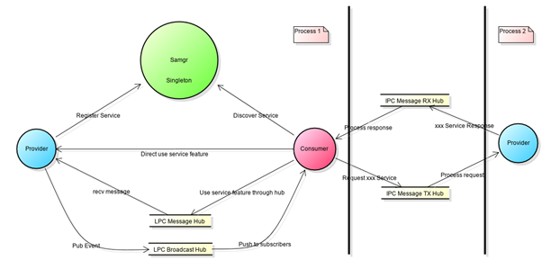
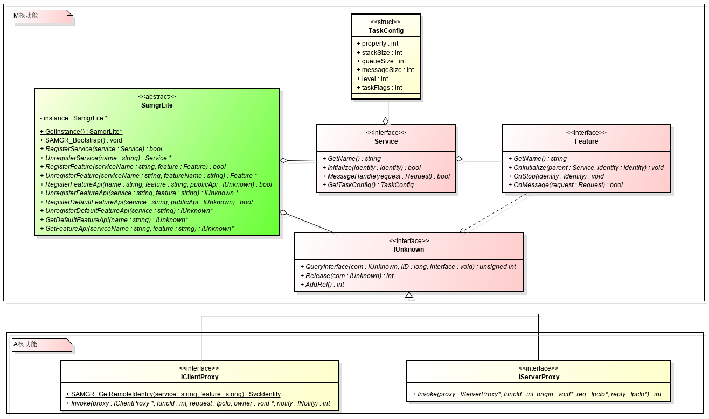

# 系统服务框架子系统<a name="ZH-CN_TOPIC_0000001051589563"></a>

## 简介<a name="section11660541593"></a>

这个仓库用于存放系统服务框架的代码。由于平台资源有限，且硬件平台多样，因此需要屏蔽不同硬件架构和资源的不同、以及运行形态的不同，提供统一化的系统服务开发框架。根据RISC-V、Cortex-M、Cortex-A不同硬件平台，分为两种平硬件平台，以下简称M核、A核。

M核：处理架构为Cortex-M或同等处理能力的硬件平台，系统内存一般低于512KB，无文件系统或者仅提供一个可有限使用的轻量级文件系统，遵循CMSIS接口规范。

A核：处理架构为Cortex-A或同等处理能力的硬件平台，内存资源大于512KB，文件系统完善，可存储大量数据，遵循POSIX接口规范。

系统服务框架基于面向服务的架构，提供了服务开发、服务的子功能开发、对外接口的开发、以及多服务共进程、进程间服务调用等开发能力。其中：

-   M核：包含服务开发、服务的子功能开发、对外接口的开发以及多服务共进程的开发框架。
-   A核：在M核能力基础之上，包含了进程间服务调用、进程间服务调用权限控制、进程间服务接口的开发等能力。

面向服务的架构：



Provider：服务的提供者，为系统提供能力（对外接口）。

Consumer：服务的消费者，调用服务提供的功能（对外接口）。

Samgr：做为中介者，管理Provider提供的能力，同时帮助Consumer发现Provider的能力。

系统服务开发框架主体对象：



-   SamgrLite：主要提供服务的注册与发现能力。
-   Service：开发服务时，需要实现的服务的生命周期接口。
-   Feature：开发功能时，需要实现的功能的生命周期接口。
-   IUnknown：基于IUnknown开发服务或功能的对外接口。
-   IClientProxy：IPC调用时，消费者的消息发送代理。
-   IServerProxy：IPC调用时，开发者需要实现的，生产者的消息处理代理。

## 目录<a name="section1464106163817"></a>

**表 1**  系统服务框架源代码目录结构

<a name="table2977131081412"></a>
<table><thead align="left"><tr id="row7977610131417"><th class="cellrowborder" valign="top" width="31.3%" id="mcps1.2.3.1.1"><p id="p18792459121314"><a name="p18792459121314"></a><a name="p18792459121314"></a>名称</p>
</th>
<th class="cellrowborder" valign="top" width="68.7%" id="mcps1.2.3.1.2"><p id="p77921459191317"><a name="p77921459191317"></a><a name="p77921459191317"></a>描述</p>
</th>
</tr>
</thead>
<tbody><tr id="row17977171010144"><td class="cellrowborder" valign="top" width="31.3%" headers="mcps1.2.3.1.1 "><p id="p2793159171311"><a name="p2793159171311"></a><a name="p2793159171311"></a>interfaces/kits/samgr_lite/samgr</p>
</td>
<td class="cellrowborder" valign="top" width="68.7%" headers="mcps1.2.3.1.2 "><p id="p879375920132"><a name="p879375920132"></a><a name="p879375920132"></a>M核和A核系统服务框架对外接口定义。</p>
</td>
</tr>
<tr id="row6978161091412"><td class="cellrowborder" valign="top" width="31.3%" headers="mcps1.2.3.1.1 "><p id="p37931659101311"><a name="p37931659101311"></a><a name="p37931659101311"></a>interfaces/kits/samgr_lite/registry</p>
</td>
<td class="cellrowborder" valign="top" width="68.7%" headers="mcps1.2.3.1.2 "><p id="p6793059171318"><a name="p6793059171318"></a><a name="p6793059171318"></a>A核进程间服务调用的对外接口定义。</p>
</td>
</tr>
<tr id="row6978201031415"><td class="cellrowborder" valign="top" width="31.3%" headers="mcps1.2.3.1.1 "><p id="p117935599130"><a name="p117935599130"></a><a name="p117935599130"></a>interfaces/kits/samgr_lite/communication/broadcast</p>
</td>
<td class="cellrowborder" valign="top" width="68.7%" headers="mcps1.2.3.1.2 "><p id="p0793185971316"><a name="p0793185971316"></a><a name="p0793185971316"></a>M核和A核进程内事件广播服务的对外接口定义。</p>
</td>
</tr>
<tr id="row124243183397"><td class="cellrowborder" valign="top" width="31.3%" headers="mcps1.2.3.1.1 "><p id="p104249183396"><a name="p104249183396"></a><a name="p104249183396"></a>services/samgr_lite/samgr/adapter</p>
</td>
<td class="cellrowborder" valign="top" width="68.7%" headers="mcps1.2.3.1.2 "><p id="p2424318203914"><a name="p2424318203914"></a><a name="p2424318203914"></a>POSIX和CMSIS接口适配层来屏蔽A核M核接口差异。</p>
</td>
</tr>
<tr id="row1634915717405"><td class="cellrowborder" valign="top" width="31.3%" headers="mcps1.2.3.1.1 "><p id="p193493571406"><a name="p193493571406"></a><a name="p193493571406"></a>services/samgr_lite/samgr/registry</p>
</td>
<td class="cellrowborder" valign="top" width="68.7%" headers="mcps1.2.3.1.2 "><p id="p14349257184012"><a name="p14349257184012"></a><a name="p14349257184012"></a>M核服务注册发现的桩函数。</p>
</td>
</tr>
<tr id="row1385432741312"><td class="cellrowborder" valign="top" width="31.3%" headers="mcps1.2.3.1.1 "><p id="p1485582714135"><a name="p1485582714135"></a><a name="p1485582714135"></a>services/samgr_lite/samgr/source</p>
</td>
<td class="cellrowborder" valign="top" width="68.7%" headers="mcps1.2.3.1.2 "><p id="p085522751319"><a name="p085522751319"></a><a name="p085522751319"></a>M核和A核系统服务开发框架基础代码。</p>
</td>
</tr>
<tr id="row7968155877"><td class="cellrowborder" valign="top" width="31.3%" headers="mcps1.2.3.1.1 "><p id="p89681851717"><a name="p89681851717"></a><a name="p89681851717"></a>services/samgr_lite/samgr_client</p>
</td>
<td class="cellrowborder" valign="top" width="68.7%" headers="mcps1.2.3.1.2 "><p id="p169681051873"><a name="p169681051873"></a><a name="p169681051873"></a>A核进程间服务调用的注册与发现。</p>
</td>
</tr>
<tr id="row18291912179"><td class="cellrowborder" valign="top" width="31.3%" headers="mcps1.2.3.1.1 "><p id="p1729111214715"><a name="p1729111214715"></a><a name="p1729111214715"></a>services/samgr_lite/samgr_server</p>
</td>
<td class="cellrowborder" valign="top" width="68.7%" headers="mcps1.2.3.1.2 "><p id="p7839893352"><a name="p7839893352"></a><a name="p7839893352"></a>A核进程间服务调用的IPC地址管理和访问控制。</p>
</td>
</tr>
<tr id="row6971514279"><td class="cellrowborder" valign="top" width="31.3%" headers="mcps1.2.3.1.1 "><p id="p1797118141671"><a name="p1797118141671"></a><a name="p1797118141671"></a>services/samgr_lite/samgr_endpoint</p>
</td>
<td class="cellrowborder" valign="top" width="68.7%" headers="mcps1.2.3.1.2 "><p id="p597119145716"><a name="p597119145716"></a><a name="p597119145716"></a>A核IPC通信消息收发包管理。</p>
</td>
</tr>
<tr id="row33121991272"><td class="cellrowborder" valign="top" width="31.3%" headers="mcps1.2.3.1.1 "><p id="p143121991875"><a name="p143121991875"></a><a name="p143121991875"></a>services/samgr_lite/communication/broadcast</p>
</td>
<td class="cellrowborder" valign="top" width="68.7%" headers="mcps1.2.3.1.2 "><p id="p16312169179"><a name="p16312169179"></a><a name="p16312169179"></a>M核和A核进程内事件广播服务。</p>
</td>
</tr>
</tbody>
</table>

## 约束<a name="section1718733212019"></a>

系统服务开发框架统一使用C开发。

同进程内服务间调用统一使用IUnknown接口对外象，消息接口统一由IUnknown接口传递给本服务。

服务名和功能名必需使用常量字符串且长度小于16个字节。

M核：系统依赖上bootstrap服务，在系统启动函数中调用HOS\_SystemInit\(\)函数。

A核：系统依赖samgr库，在main函数中调用SAMGR\_Bootstrap\(\)函数。

## 开发服务<a name="section159991817144514"></a>

-   继承并重新定义服务：

    ```
    typedef struct ExampleService {
        INHERIT_SERVICE;
        INHERIT_IUNKNOWNENTRY(DefaultFeatureApi);
        Identity identity;
    } ExampleService;
    ```

-   实现服务的生命周期函数：

    ```
    static const char *GetName(Service *service)
    {
        return EXAMPLE_SERVICE;
    }
    
    static BOOL Initialize(Service *service, Identity identity)
    {
        ExampleService *example = (ExampleService *)service;
        // 保存服务的唯一身份标识，用来自己的IUnknown接口对服务发消息时使用。
        example->identity = identity;
        return TRUE;
    }
    static BOOL MessageHandle(Service *service, Request *msg)
    {
        ExampleService *example = (ExampleService *)service;
        switch (msg->msgId) {
            case MSG_SYNC:
                // 业务处理
                break;
            default:break;
        }
        return FALSE;
    }
    static TaskConfig GetTaskConfig(Service *service)
    {
        TaskConfig config = {LEVEL_HIGH, PRI_BELOW_NORMAL,
                             0x800, 20, SHARED_TASK};
        return config;
    }
    ```

-   创建服务对象：

    ```
    static ExampleService g_example = {
        .GetName = GetName,
        .Initialize = Initialize,
        .MessageHandle = MessageHandle,
        .GetTaskConfig = GetTaskConfig,
        SERVER_IPROXY_IMPL_BEGIN,
            .Invoke = NULL,
            .SyncCall = SyncCall,
        IPROXY_END,
    };
    ```

-   向SAMGR注册服务及接口：

    ```
    static void Init(void)
    {
        SAMGR_GetInstance()->RegisterService((Service *)&g_example);
        SAMGR_GetInstance()->RegisterDefaultFeatureApi(EXAMPLE_SERVICE, GET_IUNKNOWN(g_example));
    }
    ```

-   定义服务的初始化入口：

    ```
    SYSEX_SERVICE_INIT(Init);
    
    ```


## 开发服务的子功能<a name="section11510542164514"></a>

-   继承并重新定义功能：

    ```
    typedef struct DemoFeature {
        INHERIT_FEATURE;
        INHERIT_IUNKNOWNENTRY(DemoApi);
        Identity identity;
        Service *parent;
    } DemoFeature;
    ```

-   实现功能的生命周期函数：

    ```
    static const char *FEATURE_GetName(Feature *feature)
    {
        return EXAMPLE_FEATURE;
    }
    
    static void FEATURE_OnInitialize(Feature *feature, Service *parent, Identity identity)
    {
        DemoFeature *demoFeature = (DemoFeature *)feature;
        demoFeature->identity = identity;
        demoFeature->parent = parent;
    }
    
    static void FEATURE_OnStop(Feature *feature, Identity identity)
    {
        g_example.identity.queueId = NULL;
        g_example.identity.featureId = -1;
        g_example.identity.serviceId = -1;
    }
    
    static BOOL FEATURE_OnMessage(Feature *feature, Request *request)
    {
        if (request->msgId == MSG_PROC) {
            Response response = {.data = "Yes, you did!", .len = 0};
            SAMGR_SendResponse(request, &response);
            return TRUE;
        } else {
            if (request->msgId == MSG_TIME_PROC) {
                LOS_Msleep(WAIT_FEATURE_PROC * 10);
                if (request->msgValue) {
                    SAMGR_PrintServices();
                } else {
                    SAMGR_PrintOperations();
                }
                AsyncTimeCall(GET_IUNKNOWN(g_example));
                return FALSE;
            }
        }
        return FALSE;
    }
    ```

-   创建功能对象：

    ```
    static DemoFeature g_example = {
        .GetName = FEATURE_GetName,
        .OnInitialize = FEATURE_OnInitialize,
        .OnStop = FEATURE_OnStop,
        .OnMessage = FEATURE_OnMessage,
        DEFAULT_IUNKNOWN_ENTRY_BEGIN,
            .AsyncCall = AsyncCall,
            .AsyncTimeCall = AsyncTimeCall,
            .SyncCall = SyncCall,
            .AsyncCallBack = AsyncCallBack,
        DEFAULT_IUNKNOWN_ENTRY_END,
        .identity = {-1, -1, NULL},
    };
    ```

-   向SAMGR注册功能及接口：

    ```
    static void Init(void){
        SAMGR_GetInstance()->RegisterFeature(EXAMPLE_SERVICE, (Feature *)&g_example);
        SAMGR_GetInstance()->RegisterFeatureApi(EXAMPLE_SERVICE, EXAMPLE_FEATURE, GET_IUNKNOWN(g_example));
    }
    ```

-   定义功能的初始化入口：

    ```
    SYSEX_FEATURE_INIT(Init);
    
    ```


## 开发进程内对外接口<a name="section1685211117463"></a>

-   定义IUnknown接口：

    ```
    typedef struct DemoApi {
        INHERIT_IUNKNOWN;
        BOOL (*AsyncCall)(IUnknown *iUnknown, const char *buff);
        BOOL (*AsyncTimeCall)(IUnknown *iUnknown);
        BOOL (*SyncCall)(IUnknown *iUnknown, struct Payload *payload);
        BOOL (*AsyncCallBack)(IUnknown *iUnknown, const char *buff, Handler handler);
    } DemoApi;
    ```

-   定义IUnknown的引用对象：

    ```
    typedef struct DemoRefApi {
        INHERIT_IUNKNOWNENTRY(DemoApi);
    } DemoRefApi;
    ```

-   初始化接口对象：

    ```
    static DemoRefApi api = {
        DEFAULT_IUNKNOWN_ENTRY_BEGIN,
            .AsyncCall = AsyncCall,
            .AsyncTimeCall = AsyncTimeCall,
            .SyncCall = SyncCall,
            .AsyncCallBack = AsyncCallBack,
        DEFAULT_IUNKNOWN_ENTRY_END,
    };
    ```

-   注册服务接口：

    ```
    SAMGR_GetInstance()->RegisterFeatureApi(EXAMPLE_SERVICE, EXAMPLE_FEATURE, GET_IUNKNOWN(api));
    
    ```


## 调用进程内服务<a name="section3690162916462"></a>

-   获取服务的对外接口：

    ```
    DemoApi *demoApi = NULL;
    IUnknown *iUnknown = SAMGR_GetInstance()->GetFeatureApi(EXAMPLE_SERVICE, EXAMPLE_FEATURE);
    if (iUnknown == NULL) {
        return NULL;
    }
    int result = iUnknown->QueryInterface(iUnknown, DEFAULT_VERSION, (void **)&demoApi);
    if (result != 0 || demoApi == NULL) {
        return NULL;
    }
    ```

-   接口调用：

    ```
    if (demoApi->AsyncCallBack == NULL) {
        return NULL;
    }
    demoApi->AsyncCallBack((IUnknown *)demoApi, "I wanna async call callback good result!", AsyncHandler);
    ```

-   释放接口：

    ```
    int32 ref = demoApi->Release((IUnknown *)demoApi);
    
    ```


## 开发跨进程间对外接口<a name="section9220246194615"></a>

-   继承IServerProxy替代继承IUnknown：INHERIT\_SERVER\_IPROXY

    ```
    typedef struct DemoFeatureApi {
        INHERIT_SERVER_IPROXY;
        BOOL (*AsyncCall)(IUnknown *iUnknown, const char *buff);
        BOOL (*AsyncTimeCall)(IUnknown *iUnknown);
        BOOL (*SyncCall)(IUnknown *iUnknown, struct Payload *payload);
        BOOL (*AsyncCallBack)(IUnknown *iUnknown, const char *buff, IOwner notify, INotifyFunc handler);
    } DemoFeatureApi;
    ```

-   初始化IServerProxy的Invoke函数：

    ```
    static DemoFeature g_example = {
        SERVER_IPROXY_IMPL_BEGIN,
        .Invoke = Invoke,
        .AsyncCall = AsyncCall,
        .AsyncTimeCall = AsyncTimeCall,
        .SyncCall = SyncCall,
        .AsyncCallBack = AsyncCallBack,
        IPROXY_END,
    };
    ```

-   实现Invoke函数来处理Ipc消息：

    ```
    static int32 Invoke(IServerProxy *iProxy, int funcId, void *origin, IpcIo *req, IpcIo *reply)
    {
        DemoFeatureApi *api = (DemoFeatureApi *)iProxy;
        BOOL ret;
        size_t len = 0;
        switch (funcId) {
            case ID_ASYNCALL:
                ret = api->AsyncCall((IUnknown *)iProxy, (char *)IpcIoPopString(req, &len));
                IpcIoPushBool(reply, ret);
                break;
            case ID_ASYNTIMECALL:
                ret = api->AsyncTimeCall((IUnknown *)iProxy);
                IpcIoPushBool(reply, ret);
                break;
            case ID_SYNCCALL: {
                struct Payload payload;
                payload.id = IpcIoPopInt32(req);
                payload.value = IpcIoPopInt32(req);
                payload.name = (char *)IpcIoPopString(req, &len);
                ret = api->SyncCall((IUnknown *)iProxy, &payload);
                IpcIoPushString(reply, ret ? "TRUE" : "FALSE");
            }
                break;
            case ID_ASYNCCALLBACK: { // convert to sync proxy
                IpcIoPushString(reply, "Yes, you did!");
                IpcIoPushBool(reply, TRUE);
            }
                break;
            default:
                IpcIoPushBool(reply, FALSE);
                break;
        }
        return EC_SUCCESS;
    }
    ```

-   注册接口：与进程内接口注册一致

    ```
    SAMGR_GetInstance()->RegisterFeatureApi(EXAMPLE_SERVICE, EXAMPLE_FEATURE, GET_IUNKNOWN(g_example));
    
    ```


## 调用跨进程间服务<a name="section114372711475"></a>

-   获取跨进程服务的对外接口：

    ```
    IClientProxy *demoApi = NULL;
    IUnknown *iUnknown = SAMGR_GetInstance()->GetFeatureApi(EXAMPLE_SERVICE, EXAMPLE_FEATURE);
    if (iUnknown == NULL) {
        return NULL;
    }
    int result = iUnknown->QueryInterface(iUnknown, CLIENT_PROXY_VER, (void **)&demoApi);
    if (result != 0 || demoApi == NULL) {
        return NULL;
    }
    ```

-   调用Ipc消息接口：

    ```
    IpcIo request;char data[250];
    IpcIoInit(&request, data, sizeof(data), 0);
    demoApi->Invoke(demoApi, 0, &request, NULL, NULL);
    ```

-   释放接口：

    ```
    int32 ref = demoApi->Release((IUnknown *)demoApi);
    
    ```


## 开发跨进程间服务调用客户端代理<a name="section09341923114710"></a>

-   定义IPC接口客户端代理：

    ```
    typedef struct DemoClientProxy {
        INHERIT_CLIENT_IPROXY;
        BOOL (*AsyncCall)(IUnknown *iUnknown, const char *buff);
        BOOL (*AsyncTimeCall)(IUnknown *iUnknown);
        BOOL (*SyncCall)(IUnknown *iUnknown, struct Payload *payload);
        BOOL (*AsyncCallBack)(IUnknown *iUnknown, const char *buff, IOwner notify, INotifyFunc handler);
    } DemoClientProxy;
    typedef struct DemoClientEntry {
        INHERIT_IUNKNOWNENTRY(DemoClientProxy);
    } DemoClientEntry;
    ```

-   实现客户端代理封装Ipc消息接口：

    ```
    static BOOL AsyncCall(IUnknown *iUnknown, const char *buff)
    {
        DemoClientProxy *proxy = (DemoClientProxy *)iUnknown;
        IpcIo request;
        char data[MAX_DATA_LEN];
        IpcIoInit(&request, data, MAX_DATA_LEN, 0);
        IpcIoPushString(&request, buff);
        int ret = proxy->Invoke((IClientProxy *)proxy, ID_ASYNCALL, &request, NULL, NULL);
        return ret == EC_SUCCESS;
    }
    
    static BOOL AsyncTimeCall(IUnknown *iUnknown)
    {
        DemoClientProxy *proxy = (DemoClientProxy *)iUnknown;
        IpcIo request;
        char data[MAX_DATA_LEN];
        IpcIoInit(&request, data, MAX_DATA_LEN, 0);
        int ret = proxy->Invoke((IClientProxy *)proxy, ID_ASYNTIMECALL, &request, NULL, NULL);
        return ret == EC_SUCCESS;
    }
    
    static int Callback(IOwner owner, int code, IpcIo *reply)
    {
        size_t len = 0;
        return strcpy_s(owner, MAX_DATA_LEN, (char *)IpcIoPopString(reply, &len));
    }
    
    static BOOL SyncCall(IUnknown *iUnknown, struct Payload *payload)
    {
        DemoClientProxy *proxy = (DemoClientProxy *)iUnknown;
        IpcIo request;
        char data[MAX_DATA_LEN];
        IpcIoInit(&request, data, MAX_DATA_LEN, 0);
        IpcIoPushInt32(&request, payload->id);
        IpcIoPushInt32(&request, payload->value);
        IpcIoPushString(&request, payload->name);
        int ret = proxy->Invoke((IClientProxy *)proxy, ID_SYNCCALL, &request, data, Callback);
        data[MAX_DATA_LEN - 1] = 0;
        HILOG_INFO(HILOG_MODULE_APP, "[TID:0x%lx]Remote response is %s!", pthread_self(), data);
        return ret == EC_SUCCESS;
    }
    
    struct CurrentNotify {
        IOwner notify;
        INotifyFunc handler;
    };
    
    static int CurrentCallback(IOwner owner, int code, IpcIo *reply)
    {
        struct CurrentNotify *notify = (struct CurrentNotify *)owner;
        size_t len = 0;
        char *response = (char *)IpcIoPopString(reply, &len);
        HILOG_INFO(HILOG_MODULE_APP, "[TID:0x%lx]Notify Remote response is %s!", pthread_self(), response);
        notify->handler(notify->notify, response);
        return EC_SUCCESS;
    }
    
    static BOOL AsyncCallBack(IUnknown *iUnknown, const char *buff, IOwner notify, INotifyFunc handler)
    {
        struct CurrentNotify owner = {notify, handler};
        DemoClientProxy *proxy = (DemoClientProxy *)iUnknown;
        IpcIo request;
        char data[MAX_DATA_LEN];
        IpcIoInit(&request, data, MAX_DATA_LEN, 0);
        IpcIoPushString(&request, buff);
        int ret = proxy->Invoke((IClientProxy *)proxy, ID_ASYNCCALLBACK, &request, &owner, CurrentCallback);
        return ret == EC_SUCCESS;
    }
    ```

-   实现客户端代理的工厂方法：

    ```
    void *DEMO_CreatClient(const char *service, const char *feature, uint32 size)
    {
        (void)service;
        (void)feature;
        uint32 len = size + sizeof(DemoClientEntry);
        uint8 *client = malloc(len);
        (void)memset_s(client, len, 0, len);
        DemoClientEntry *entry = (DemoClientEntry *)&client[size];
        entry->ver = ((uint16)CLIENT_PROXY_VER | (uint16)DEFAULT_VERSION);
        entry->ref = 1;
        entry->iUnknown.QueryInterface = IUNKNOWN_QueryInterface;
        entry->iUnknown.AddRef = IUNKNOWN_AddRef;
        entry->iUnknown.Release = IUNKNOWN_Release;
        entry->iUnknown.Invoke = NULL;
        entry->iUnknown.AsyncCall = AsyncCall;
        entry->iUnknown.AsyncTimeCall = AsyncTimeCall;
        entry->iUnknown.SyncCall = SyncCall;
        entry->iUnknown.AsyncCallBack = AsyncCallBack;
        return client;
    }
    void DEMO_DestroyClient(const char *service, const char *feature, void *iproxy)
    {
        free(iproxy);
    }
    ```

-   将客户端代理的工厂方法注册到SAMGR：

    ```
    SAMGR_RegisterFactory(EXAMPLE_SERVICE, EXAMPLE_FEATURE, DEMO_CreatClient, DEMO_DestroyClient);
    ```

-   获取跨进程服务的对外接口：

    ```
    DemoClientProxy *demoApi = NULL;
    IUnknown *iUnknown = SAMGR_GetInstance()->GetFeatureApi(EXAMPLE_SERVICE, EXAMPLE_FEATURE);
    if (iUnknown == NULL) {
        return NULL;
    }
    int result = iUnknown->QueryInterface(iUnknown, DEFAULT_VERSION, (void **)&demoApi);
    if (result != 0 || demoApi == NULL) {
        return NULL;
    }
    ```

-   调用跨进程服务的客户端代理接口：

    ```
    if (demoApi->AsyncCallBack == NULL) {
        return NULL;
    }
    demoApi->AsyncCallBack((IUnknown *)demoApi,
                           "I wanna async call callback good result!", NULL, AsyncHandler);
    ```

-   释放接口：

    ```
    int32 ref = demoApi->Release((IUnknown *)demoApi);
    ```


## 涉及仓<a name="section10365113863719"></a>

distributedschedule\_interfaces\_innerkits\_samgr\_lite

distributedschedule\_services\_samgr\_lite

