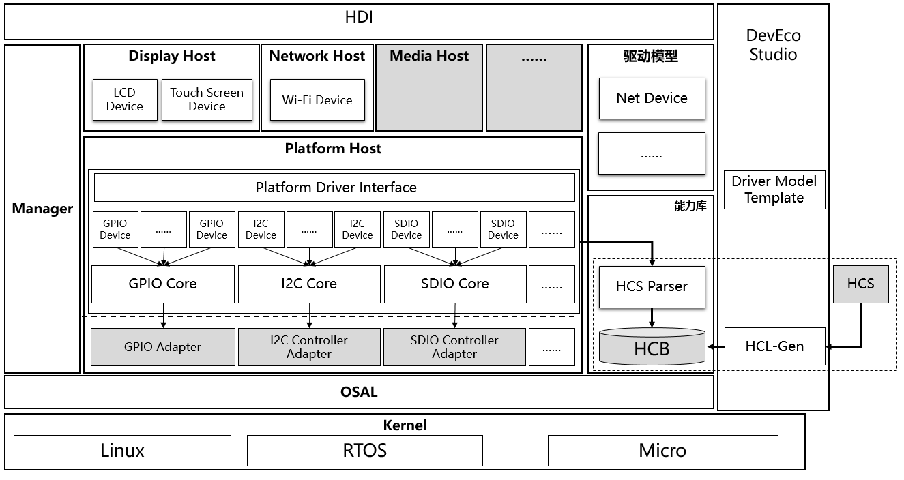
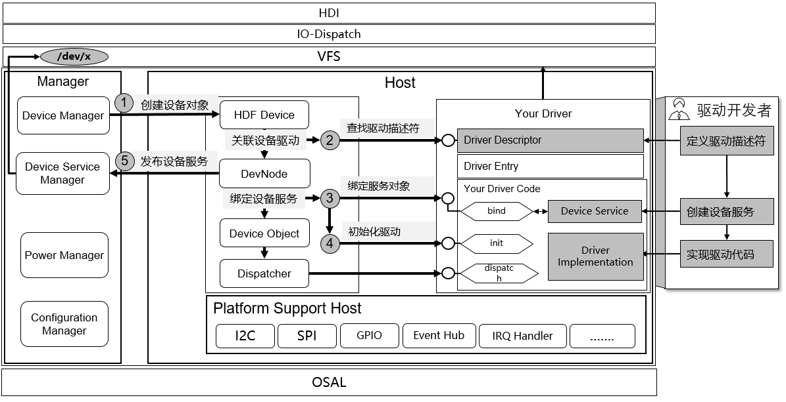
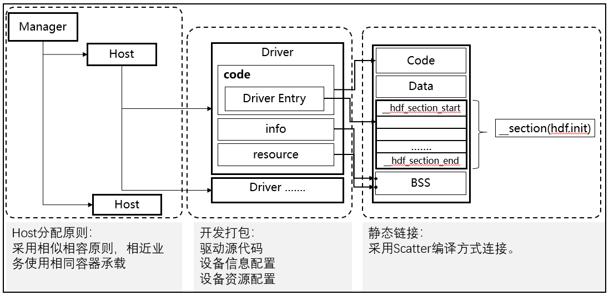

# 驱动子系统<a name="ZH-CN_TOPIC_0000001052619216"></a>

## 简介<a name="section11660541593"></a>

OpenHarmony驱动子系统采用采用C面向对象编程模型构建，通过平台解耦、内核解耦，兼容不同内核，提供了归一化的驱动平台底座，旨在为开发者提供更精准、更高效的开发环境，力求做到一次开发，多系统部署。

为了缩减驱动开发者的驱动开发周期，降低三方设备驱动集成难度，OpenHarmony驱动子系统支持以下关键特性和能力。

-   弹性化的框架能力：

    在传统的驱动框架能力的基础上，OpenHarmony驱动子系统通过构建弹性化的框架能力，可支持在百K级别到百兆级容量的终端产品形态部署。


-   规范化的驱动接口：

    定义了常见驱动接口，为驱动开发者和使用者提供丰富、稳定接口，并和未来开放的面向手机、平板、智慧屏等设备驱动接口保持API兼容性。


-   组件化的驱动模型：

    支持组件化的驱动模型，开发者提供更精细化的驱动管理，开发者可以对驱动进行组件化拆分，使得驱动开发者可以更多关注驱动与硬件交互部分。

    同时系统也预置了部分模板化的驱动模型组件，如网络设备模型等。


-   归一化的配置界面：

    提供统一的配置界面，构建跨平台的配置转换和生成工具，实现跨平台的无缝切换


为了方便驱动开发者更易于开发OpenHarmony驱动程序，OpenHarmony驱动子系统在DevEco集成驱动开发套件工具，支持驱动工程管理，驱动模板生成、配置管理等界面化的操作。

## 架构<a name="section101721227145613"></a>

OpenHarmony驱动框架采用主从架构设计模式，围绕着框架、模型、能力库和工具四个维度能力展开构建。

**图 1**  驱动和框架交互流程<a name="fig2213154653916"></a>  




-   驱动框架 -位于frameworks/core目录
    -   提供驱动框架能力，主要完成驱动加载和启动功能。
    -   通过对象管理器方式可实现驱动框架的弹性化部署和扩展。

-   驱动模型 - 位于frameworks/model目录
    -   提供了模型化驱动能力，如网络设备模型。

-   驱动能力库 - 位于frameworks/ability目录
    -   提供基础驱动能力模型，如IO通信能力模型。

-   驱动工具 - 位于frameworks\\tools目录
    -   提供HDI接口转换、驱动配置编译等工具。

-   驱动接口 - 位于lite\\hdi
    -   提供规范化的驱动接口。

-   Support - 位于frameworks/support目录，
    -   提供规范化的平台驱动接口和系统接口抽象能力。


## 目录<a name="section1464106163817"></a>

**表 1**  OpenHarmony驱动框架源代码目录结构

<a name="table2977131081412"></a>
<table><thead align="left"><tr id="row7977610131417"><th class="cellrowborder" valign="top" width="30.34%" id="mcps1.2.3.1.1"><p id="p18792459121314"><a name="p18792459121314"></a><a name="p18792459121314"></a>名称</p>
</th>
<th class="cellrowborder" valign="top" width="69.66%" id="mcps1.2.3.1.2"><p id="p77921459191317"><a name="p77921459191317"></a><a name="p77921459191317"></a>描述</p>
</th>
</tr>
</thead>
<tbody><tr id="row17666001869"><td class="cellrowborder" valign="top" width="30.34%" headers="mcps1.2.3.1.1 "><p id="p4667601064"><a name="p4667601064"></a><a name="p4667601064"></a>hdf</p>
</td>
<td class="cellrowborder" valign="top" width="69.66%" headers="mcps1.2.3.1.2 "><p id="p154741318610"><a name="p154741318610"></a><a name="p154741318610"></a>OpenHarmony驱动框架。</p>
</td>
</tr>
<tr id="row17977171010144"><td class="cellrowborder" valign="top" width="30.34%" headers="mcps1.2.3.1.1 "><p id="p2793159171311"><a name="p2793159171311"></a><a name="p2793159171311"></a>hdf\frameworks</p>
</td>
<td class="cellrowborder" valign="top" width="69.66%" headers="mcps1.2.3.1.2 "><p id="p879375920132"><a name="p879375920132"></a><a name="p879375920132"></a>完成驱动框架、驱动模型和能力模型库相关代码。</p>
</td>
</tr>
<tr id="row258624313915"><td class="cellrowborder" valign="top" width="30.34%" headers="mcps1.2.3.1.1 "><p id="p858718432912"><a name="p858718432912"></a><a name="p858718432912"></a>hdf\frameworks\ability</p>
</td>
<td class="cellrowborder" valign="top" width="69.66%" headers="mcps1.2.3.1.2 "><p id="p1866016071012"><a name="p1866016071012"></a><a name="p1866016071012"></a>提供驱动开发的功能能力支持，如消息模型库等。</p>
</td>
</tr>
<tr id="row6978161091412"><td class="cellrowborder" valign="top" width="30.34%" headers="mcps1.2.3.1.1 "><p id="p37931659101311"><a name="p37931659101311"></a><a name="p37931659101311"></a>hdf\frameworks\core</p>
</td>
<td class="cellrowborder" valign="top" width="69.66%" headers="mcps1.2.3.1.2 "><p id="p6793059171318"><a name="p6793059171318"></a><a name="p6793059171318"></a>实现OpenHarmony驱动框架的核心代码部分。</p>
</td>
</tr>
<tr id="row6978201031415"><td class="cellrowborder" valign="top" width="30.34%" headers="mcps1.2.3.1.1 "><p id="p117935599130"><a name="p117935599130"></a><a name="p117935599130"></a>hdf\frameworks\core\host</p>
</td>
<td class="cellrowborder" valign="top" width="69.66%" headers="mcps1.2.3.1.2 "><p id="p53051522133"><a name="p53051522133"></a><a name="p53051522133"></a>提供驱动宿主环境框架功能，主要包含：</p>
<p id="p168291956191214"><a name="p168291956191214"></a><a name="p168291956191214"></a>1、驱动加载、启动以及对外发布设备节点功能。</p>
<p id="p945834131310"><a name="p945834131310"></a><a name="p945834131310"></a>2、提供驱动事件分发。</p>
<p id="p1365513245138"><a name="p1365513245138"></a><a name="p1365513245138"></a>3、驱动内部电源状态管理功能。</p>
<p id="p113814121414"><a name="p113814121414"></a><a name="p113814121414"></a>4、提供公共的驱动资源配置管理。</p>
</td>
</tr>
<tr id="row138241821218"><td class="cellrowborder" valign="top" width="30.34%" headers="mcps1.2.3.1.1 "><p id="p1138321861211"><a name="p1138321861211"></a><a name="p1138321861211"></a>hdf\frameworks\core\manager</p>
</td>
<td class="cellrowborder" valign="top" width="69.66%" headers="mcps1.2.3.1.2 "><p id="p103831518181211"><a name="p103831518181211"></a><a name="p103831518181211"></a>驱动框架管理模块主要包含：</p>
<p id="p1125114971315"><a name="p1125114971315"></a><a name="p1125114971315"></a>1、驱动对外服务接口管理。</p>
<p id="p419655510136"><a name="p419655510136"></a><a name="p419655510136"></a>2、驱动设备信息配置管理。</p>
<p id="p95776361144"><a name="p95776361144"></a><a name="p95776361144"></a>3、驱动设备节点管理。</p>
<p id="p75789456140"><a name="p75789456140"></a><a name="p75789456140"></a>4、安全管理模块。</p>
<p id="p183476761517"><a name="p183476761517"></a><a name="p183476761517"></a>5、驱动故障恢复管理功能模块。</p>
</td>
</tr>
<tr id="row116251627171512"><td class="cellrowborder" valign="top" width="30.34%" headers="mcps1.2.3.1.1 "><p id="p76251275152"><a name="p76251275152"></a><a name="p76251275152"></a>hdf\frameworks\core\shared</p>
</td>
<td class="cellrowborder" valign="top" width="69.66%" headers="mcps1.2.3.1.2 "><p id="p56256278150"><a name="p56256278150"></a><a name="p56256278150"></a>提供host和manager共享模块代码。</p>
</td>
</tr>
<tr id="row2306123015162"><td class="cellrowborder" valign="top" width="30.34%" headers="mcps1.2.3.1.1 "><p id="p10306143019164"><a name="p10306143019164"></a><a name="p10306143019164"></a>hdf\frameworks\model</p>
</td>
<td class="cellrowborder" valign="top" width="69.66%" headers="mcps1.2.3.1.2 "><p id="p1030713021612"><a name="p1030713021612"></a><a name="p1030713021612"></a>提供驱动通用框架模型。</p>
</td>
</tr>
<tr id="row2021312310176"><td class="cellrowborder" valign="top" width="30.34%" headers="mcps1.2.3.1.1 "><p id="p421315312177"><a name="p421315312177"></a><a name="p421315312177"></a>hdf\frameworks\model\network</p>
</td>
<td class="cellrowborder" valign="top" width="69.66%" headers="mcps1.2.3.1.2 "><p id="p421313113179"><a name="p421313113179"></a><a name="p421313113179"></a>提供驱动网络设备模型。</p>
</td>
</tr>
<tr id="row2167642189"><td class="cellrowborder" valign="top" width="30.34%" headers="mcps1.2.3.1.1 "><p id="p21683416181"><a name="p21683416181"></a><a name="p21683416181"></a>hdf\frameworks\support\</p>
</td>
<td class="cellrowborder" valign="top" width="69.66%" headers="mcps1.2.3.1.2 "><p id="p71681548183"><a name="p71681548183"></a><a name="p71681548183"></a>提供驱动使用的系统接口资源和硬件资源，如GPIO、I2C、SPI等通用平台接口能力。</p>
<p id="p19848191416195"><a name="p19848191416195"></a><a name="p19848191416195"></a>该接口部分与平台无关可支持跨平台迁移。</p>
</td>
</tr>
<tr id="row15342553171918"><td class="cellrowborder" valign="top" width="30.34%" headers="mcps1.2.3.1.1 "><p id="p434255301916"><a name="p434255301916"></a><a name="p434255301916"></a>hdf\frameworks\support\osal</p>
</td>
<td class="cellrowborder" valign="top" width="69.66%" headers="mcps1.2.3.1.2 "><p id="p1234211535198"><a name="p1234211535198"></a><a name="p1234211535198"></a>提供通用平台适配接口，如内存、线程、锁等资源。</p>
</td>
</tr>
<tr id="row116634294203"><td class="cellrowborder" valign="top" width="30.34%" headers="mcps1.2.3.1.1 "><p id="p1866392919204"><a name="p1866392919204"></a><a name="p1866392919204"></a>hdf\frameworks\support\platform</p>
</td>
<td class="cellrowborder" valign="top" width="69.66%" headers="mcps1.2.3.1.2 "><p id="p5663329202017"><a name="p5663329202017"></a><a name="p5663329202017"></a>提供通用平台硬件资源支撑接口，如GPIO、I2C、SPI等能力。</p>
</td>
</tr>
<tr id="row193157275210"><td class="cellrowborder" valign="top" width="30.34%" headers="mcps1.2.3.1.1 "><p id="p1331513279211"><a name="p1331513279211"></a><a name="p1331513279211"></a>hdf\frameworks\tools</p>
</td>
<td class="cellrowborder" valign="top" width="69.66%" headers="mcps1.2.3.1.2 "><p id="p131542762113"><a name="p131542762113"></a><a name="p131542762113"></a>提供驱动功能能力库，如HCS驱动配置编译工具等。</p>
</td>
</tr>
<tr id="row66349163223"><td class="cellrowborder" valign="top" width="30.34%" headers="mcps1.2.3.1.1 "><p id="p2634161611224"><a name="p2634161611224"></a><a name="p2634161611224"></a>hdf\frameworks\utils</p>
</td>
<td class="cellrowborder" valign="top" width="69.66%" headers="mcps1.2.3.1.2 "><p id="p26341516202215"><a name="p26341516202215"></a><a name="p26341516202215"></a>提供基础数据结构和算法等。</p>
</td>
</tr>
<tr id="row1897841071415"><td class="cellrowborder" valign="top" width="30.34%" headers="mcps1.2.3.1.1 "><p id="p16793185961315"><a name="p16793185961315"></a><a name="p16793185961315"></a>hdf\lite\adapter</p>
</td>
<td class="cellrowborder" valign="top" width="69.66%" headers="mcps1.2.3.1.2 "><p id="p14793959161317"><a name="p14793959161317"></a><a name="p14793959161317"></a>实现对内核操作接口适配，提供抽象化的接口供开发者使用。</p>
</td>
</tr>
<tr id="row16448173512518"><td class="cellrowborder" valign="top" width="30.34%" headers="mcps1.2.3.1.1 "><p id="p644893514514"><a name="p644893514514"></a><a name="p644893514514"></a>hdf\lite\include</p>
</td>
<td class="cellrowborder" valign="top" width="69.66%" headers="mcps1.2.3.1.2 "><p id="p1744933517511"><a name="p1744933517511"></a><a name="p1744933517511"></a>提供OpenHarmony驱动框架面向轻量化设备开放的驱动接口接口。</p>
</td>
</tr>
<tr id="row192731625216"><td class="cellrowborder" valign="top" width="30.34%" headers="mcps1.2.3.1.1 "><p id="p10281116185217"><a name="p10281116185217"></a><a name="p10281116185217"></a>hdf\lite\hdi</p>
</td>
<td class="cellrowborder" valign="top" width="69.66%" headers="mcps1.2.3.1.2 "><p id="p7286165524"><a name="p7286165524"></a><a name="p7286165524"></a>提供OpenHarmony驱动程序接口。</p>
</td>
</tr>
</tbody>
</table>

## 约束<a name="section1718733212019"></a>

无。

## 使用<a name="section8496817141616"></a>

**图 2**  驱动和框架交互流程<a name="fig1254113325118"></a>  




驱动框架完成大部分驱动加载的动作，用户只需注册自己所需的接口和配置，然后驱动框架就会根据解析，完成驱动加载和初始化动作。

开发者基于HDF驱动框架开发的驱动主要包含三大部分：

1、驱动程序部分 - 完成驱动的功能逻辑

2、驱动配置信息 - 指示驱动的加载信息内容

3、驱动资源配置 - 配置驱动的硬件配置信息。

驱动程序主要是完成驱动功能的开发部分：

对于开发者首先看到的是驱动入口部分，驱动入口部分通过DriverEntry对齐进行描述。

其中主要包含bind, init 和release三个接口。

```
struct HdfDriverEntry g_deviceSample = {
    .moduleVersion = 1,
    .moduleName = "sample_driver", 
    .Bind = SampleDriverBind,
    .Init = SampleDriverInit,
    .Release = SampleDriverRelease,
};
```

Bind接口描述：该接口的作用主要是完成驱动设备和设备服务接口的bind动作。

```
int32_t SampleDriverBind(struct HdfDeviceObject *deviceObject)
{
    //TODO: Bind and device service to device object.
    //And you can also initialize device resources here.
    return HDF_SUCCESS;
}
```

Init接口描述：当框架完成设备绑定动作后，就开始调用驱动初始化接口，当初始化成功后，驱动框架根据配置文件决定是否对外创建设备服务

接口，还是只是对当前服务接口可见。如果Init初始化失败的话，驱动框架就会主动释放创建的设备接口等信息。

```
int32_t SampleDriverInit(struct HdfDeviceObject *deviceObject)
{
    return HDF_SUCCESS;
}
```

Release接口描述：当用户需要卸载驱动时，驱动框架先通过该接口通知驱动程序释放资源。然后在执行其他内部资源释放。

```
void SampleDriverRelease(struct HdfDeviceObject *deviceObject)
{
    //Release all driver resources.
    return;
}
```

## 安装<a name="section14778154275818"></a>

OpenHarmony驱动主要部署在内核态，当前主要采用静态链接方式，随内核子系统编译和系统镜像打包。

**图 3**  驱动安装部署图<a name="fig675692712"></a>  




## 涉及仓<a name="section134812226297"></a>

drivers\_hdf\_frameworks

drivers\_hdf\_lite

