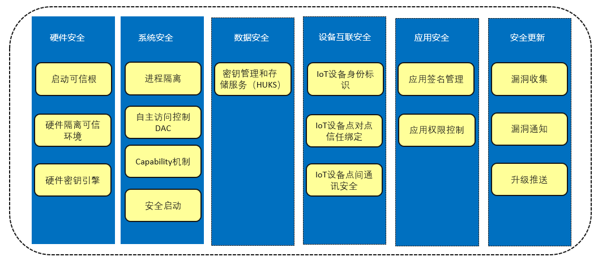
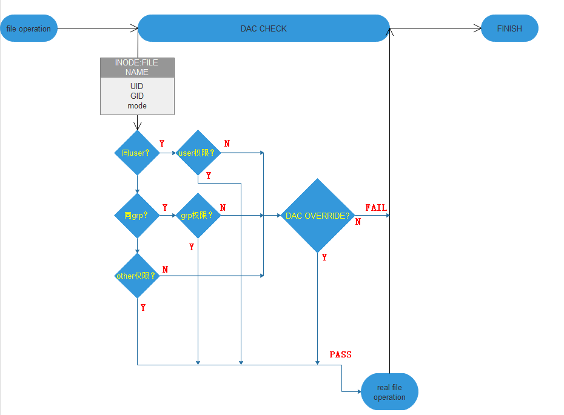
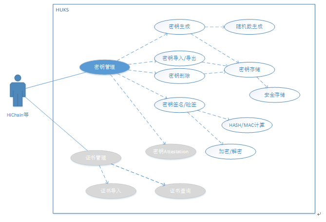

# 安全指南

## 安全概述

OpenHarmony操作系统是一个开放的系统，开发者可以通过OpenHarmony开发灵活的服务和应用，为开发者和使用者带来便利和价值。为了达到这一目的，OpenHarmony提供了一个可以有效保护应用和用户数据的执行环境。

在这个执行环境中，芯片的安全能力、系统的安全能力、以及上层的安全服务一起协作，从硬件安全、系统安全、数据安全、设备互联安全、应用安全、安全更新多个维度提供安全保障。

**图 1**  安全保障示意图  

## 硬件安全

## 安全机制

-   启动可信根

    OpenHarmony设备采用PKI（Public Key Infrastructure）体系保护软件完整性，确保设备运行来源合法、软件未被篡改。

    在设备启动流程中，逐级进行软件签名校验形成安全启动链，任何一个环节的签名校验不通过即终止设备启动；安全启动链中最初执行签名校验的软硬件实体，需确保自身的合法、未被篡改。该实体即为设备的启动可信根。启动可信根可为固化在ROM中的一段代码，这段代码在芯片制造环节固化到芯片中，芯片制造完成后软件不可更改，在设备上电初始化的过程中，最先执行这段ROM中的代码，并由这段ROM代码执行后续的软件签名校验。

    ROM中的代码在执行签名校验时，需确保用于校验的PKI公钥的合法性，OpenHarmony设备可采用eFuse/OTP等存储介质来存储公钥（如公钥哈希值），来保护公钥自身的合法性。公钥一般在设备制造环节，烧录到设备的eFuse/OTP中。

-   硬件隔离可信环境

    硬件隔离的可信环境，遵循了可信计算系统的设计理念。可信环境内外形成了两个世界：可信世界与不可信世界，两者之间存在清晰而明确的隔离边界；OpenHarmony设备在可信环境中实现了核心敏感数据的保护机制，可确保即使不可信世界的操作系统存在漏洞且被利用，也依然能确保可信环境中敏感数据的安全。

    OpenHarmony设备的可信环境，基于硬件的安全隔离机制构建，在不同的OpenHarmony设备上芯片隔离机制略有差异，较为通用的方法是采用ARM的TrustZone技术。在部分Risc-V芯片平台上，也可能采用独立安全核的形式来构建可信环境。

    可信环境中，运行特定的、精简的操作系统iTrustee lite，用于管理可信环境的资源和任务调度，给OpenHarmony设备提供安全服务。密钥管理及数据安全，是可信环境中最为常见的安全服务，设备在eFuse/OTP中存有硬件唯一根密钥，可信环境可基于该密钥结合业务上下文衍生出多种密钥，给应用提供密钥管理和数据加解密相关的服务；设备核心密钥生命周期不离开可信环境。可信环境同样可提供身份认证、系统状态监控、数据安全存储等安全服务，提高设备安全性。

-   硬件密钥引擎

    密码学是信息安全的基础。数据加解密对计算机设备的核心诉求是：高效、安全。硬件加解密技术利用计算机硬件辅助软件，甚至直接取代软件，来处理数据的加解密。相比由软件实现的加解密计算，硬件实现的加解密计算更高效、更安全。

    由硬件来实现加解密处理，意味着部分专用的硬件资源会用于处理加解密计算任务，当加解密引擎工作的时候CPU可以并发地继续执行其他计算任务，因此硬件加解密引擎可以带来极大的性能提升，同时降低CPU负载。此外，硬件密钥引擎可以带来更高的安全性，设计良好的硬件密钥引擎，哪怕软件被攻破也依然可保护密钥不泄露，甚至可对抗电磁、辐射等物理侧信道攻击。

    OpenHarmony设备支持硬件密钥引擎，支撑OpenHarmony系统进行数据加解密、证书验签、哈希计算等计算任务，可支持AES/RSA等主流的密码学算法。

## 推荐做法

-   启动可信根可由一段固化在芯片中的代码和设备根密钥组成，前者一般在芯片制造阶段写入，设备生命周期内不可更改，负责在启动阶段校验设备软件证书；后者则是用于设备证书签名的私钥相对应的公钥，证书签名私钥不出PKI签名服务器，而公钥则需写入设备。为防止攻击者篡改公钥从而达到绕过签名认证的目的，写入OpenHarmony设备的公钥须确保不可篡改，可将公钥信息写入如熔丝等介质；考虑到熔丝空间有限，可仅存储公钥的哈希值，并由启动代码校验公钥的合法性。
-   可信执行环境较为通用的做法是基于ARM TrustZone技术构建，也可根据设备的实际形态选择其他隔离机制，如TrustZone-M、独立安全核等；可信执行环境中须部署TEE OS，用于管理可信执行环境的资源及任务调度。OpenHarmony系统提供iTrustee作为TEE OS的解决方案，开发者及设备商可基于iTrustee开发并部署安全业务。

    并非所有OpenHarmony设备都强制要求支持可信执行环境，部分运行低敏感业务的瘦资源设备可不做强制要求；可根据实际业务场景选择是否支持可信执行环境，以及实现怎样的可信执行环境。

-   硬件密钥引擎须提供真随机数、公钥、对称密钥、哈希等密钥算法能力，通过在OpenHarmony系统中部署相应的驱动程序，给应用提供统一的密钥管理及密钥算法服务。

## 系统安全

## 安全机制

对于128KB\~128MB内存的设备，推荐使用HarmonyOS轻内核组件，在该内核下：

-   进程隔离

    进程隔离是为了防止A进程读写B进程内存数据的情况发生，进程的隔离技术，一般都采用虚拟地址空间映射方式，通过MMU配置，进程A的虚拟地址和进程B的虚拟地址映射各自不同的实际的物理地址段，这样A进程通过访问虚拟地址访问的实际内存数据在非共享内存的情况下，只属于A进程，B进程无法直接访问。

    OpenHarmony由于资源有限，对于内核态和用户态的进程采用不同的方式：所有的内核态进程共享同一块VMM空间，即所有的内核态进程之间无隔离，系统启动时内核态创建两个基本进程KProcess和KIdle，KProcess进程为内核态进程的根进程，KIdle进程为KProcess进程的子进程；但是对于每一个用户态进程均拥有自己独立的VMM空间，相互之间不可见，实现进程间隔离。

-   自主访问控制

    自主访问控制DAC（Discretionary Access Control）的思想是文件权限由文件拥有者来决定其他角色的访问权限。权限管控粒度分为三类：user\(自身\)， group\(组员\)，other\(其他人\)，即UGO。将任意用户分类为UGO中三者之一，并采取相应的管控策略，即完成了DAC权限校验流程。

    DAC机制依赖于进程的uid、gid等属性，需要以此作为文件创建以及文件访问过程中的特征id。文件创建时，创建者将自身uid写入文件，文件访问时，又以此作为文件归属的分类依据。

    每一个应用，对应一个uid。应用在创建文件时，将自身uid信息加入被创建文件的元数据\(metadata\)中，并设置UGO三个组的权限。在文件访问过程中，将以访问者uid作为访问校验主体、以文件元数据中的uid权限信息作为客体，进行权限校验。

    下图描述了DAC在文件访问时的鉴权过程，首先匹配进程uid和文件uid属性，其次匹配进程gid和文件gid属性，最后都匹配失败的情况，判断文件other属性是否支持进程的读、写、执行操作。同时支持忽略DAC检测机制（读、写、执行）作为一组系统特权（Capability），支持高权限（如系统服务）对低权限（三方APP）的文件管理。

    **图 2**  DAC流程图  
    

    

-   Capability机制

    Capability机制实际上是对root权限的具体细分。在多用户计算机系统中，一般会有一个特殊的角色拥有系统的所有权限，这个角色一般是系统管理员\(root\)。对于OpenHarmony这种需要支持三方应用生态的内核，需要将系统中的特权访问进行管控。系统需要对用户层访问内核的特权级系统调用进行限制。仅允许部分高权限应用进行特权操作。具体实现方式是内核spawn第一个用户程序INIT，其包含全部的特权能力，此后，INIT拉起其他应用框架服务，拉起过程中，对各应用框架进行相应的降权操作，为各应用保留必须的特权能力。 当应用去调用特权接口时，内核态就会通过进程ID查看当前访问者是否有权限访问目标接口。

-   安全启动

    安全启动是整个系统安全的基础，通过采用数字签名和完整性校验机制，从芯片内部固化的可信启动根开始，逐级校验每一层软件的完整性和合法性，确保最终启动的操作系统软件是厂家提供的正确合法的软件，防止攻击者对系统软件做恶意的篡改和植入，为整个系统提供初始安全的基础运行环境。

    在芯片上电后，由于片上ROM代码本身不可更改，因此无需校验；片上ROM基于eFuse中的非对称算法公钥hash对bootloader进行校验。这些过程都基于硬件信任根来进行，是完全可信的。经过此过程校验通过的bootloader模块可以作为后续的信任基础，此过程就是启动信任链的构造过程。Bootloader通常首先对执行环境进行一定的初始化，主要是初始化DDR以及flash读写，为进一步加载后续模块以及执行更为复杂的逻辑进行准备。Bootloader完成初始化动作后，首先完成x509证书的完整性校验，然后利用x509证书的公钥对需要校验的镜像包（kernel.bin、teeOS.bin、rootfs.bin）进行校验。

## 推荐做法

-   自主访问控制和Capability机制是控制资源被谁可以访问的机制，建议所有权限设置都采用最小权限原则。
-   安全启动必须要开启，信任根必须是基于芯片的不可更改的形式存在，并且在有安全升级的情况下，必须考虑安全升级后对于安全启动的影响，也就是安全升级后必须要更新对应镜像文件的签名信息或者hash值。

## 数据安全

## 安全机制

HUKS（Huawei  Universal Keystore Service），密钥管理和存储服务，提供了证书管理、密钥管理、安全存储和密钥认证服务，当前在OpenHarmony上主要是提供密钥管理和安全存储服务，同时支撑hichain\(设备身份认证平台\)的基础设备认证能力。如下是HUKS的功能结构图：

**图 3**  HUKS功能结构图  

支持算法包括：

认证加密：AES-128/192/256-GCM

签名验签：ED25519

密钥协商：X25519

消息认证：HMAC-SHA256/512

数据摘要：SHA256/512

HUKS在使用中有如下约束：

-   密钥安全存储：密钥要求存储于安全存储区域，数据不可以修改，恢复出厂设置时出厂预置的密钥不能被删除。
-   密钥访问安全：OpenHarmony通过将不同应用数据保存在不同的位置，来实现应用间数据的隔离。通过参数结构体中包含UID和进程ID，来实现不同应用间的数据隔离。
-   不支持并发访问：HUKS本身不考虑多个应用同时调用的情况，因为HUKS只是一个lib库，也不考虑资源的互斥。如果有多个应用都会用到HUKS服务，那么应该由每个应用各自链接一份HUKS库，并由业务传入持久化数据存储的路径，以实现应用间的数据存储分开。数据存储在各应用各自存储目录下。

## 推荐做法

对于设备认证功能，建议使用HiChain来对接HUKS，HUKS可以向HiChain等应用提供密钥的产生、导入、导出、加密/解密、存储、销毁，证书的导入和查询，秘密信息的存储等能力。

## 设备互联安全

为了实现用户数据在设备互联场景下在各个设备之间的安全流转，需要保证设备之间相互正确可信，即设备和设备之间建立信任关系，并能够在验证信任关系后，搭建安全的连接通道，实现用户数据的安全传输。设备之间的信任关系在本文档中涉及IoT主控设备和IoT设备之间建立的可信关系。设备间可信关系建立的流程如下图所示：

**图 4**  设备间建立可信关系流程图  

-   **IoT设备互联安全**

    设备互联支持基于OpenHarmony的IoT设备（如AI音箱、智能家居、智能穿戴等设备）与IoT主控设备间建立点对点的信任关系，并在具备信任关系的设备间，搭建安全的连接通道，实现用户数据端到端加密传输。

-   **IoT主控设备的IoT业务身份标识**

    IoT主控设备为不同的IoT设备管理业务生成不同的身份标识，形成不同IoT管理业务间的隔离，该标识用于IoT主控设备与IoT设备之间的认证以及通信。IoT业务身份标识为椭圆曲线公私钥对（Ed25519公私钥对）。

-   **IoT设备身份标识**

    IoT设备会生成各自的设备身份标识，用来与IoT主控设备通信。该身份标识同样为椭圆曲线公私钥对（Ed25519公私钥对）；IoT设备私钥不出IoT设备，设备每次恢复出厂设置，会重置这个公私钥对。

    上述身份标识可用于IoT主控设备与IoT设备间的安全通信：当IoT主控设备与IoT设备通过信任绑定流程交换业务身份标识或设备标识后，可以进行密钥协商并建立安全通信通道。

-   **设备间点对点的信任绑定**

    IoT主控设备和IoT设备建立点对点信任关系的过程，实际上是相互交换IoT设备的身份标识的过程。

    在点对点建立信任关系的过程中，用户需要在IoT主控设备上，输入IoT设备上提供的PIN码：对于有屏幕的设备，该PIN码动态生成；对于没有屏幕的设备，该PIN码由设备生产厂家预置；PIN码的展示形式，可以是一个用户可读的数字，也可以是一个二维码。随后，IoT主控设备和IoT设备间使用PAKE协议完成认证和会话密钥协商过程，并在此基础上，通过协商出的会话密钥加密传输通道用于交换双方设备的身份标识公钥。

-   **IoT主控设备与IoT设备间的通信安全**

    当建立过信任关系的IoT主控设备与IoT设备间进行通信时，双方在完成上述信任关系绑定后，基于本地存储的对端身份公钥相互进行认证；在每次通信时基于STS协议完成双向身份认证以及会话密钥协商，之后设备使用此会话密钥加密双方设备间的传输通道。

## 应用安全

## 安全机制

-   应用签名管控

    OpenHarmony应用的安装需要首先对包的完整性进行校验，具体策略是在开发阶段完成开发和调试后对安装包进行签名，这个签名需要使用指定的私钥，这个私钥就是跟验签用的公钥是一对的，一般的做法是OEM厂商生成一对公私钥，然后将公钥信息预置到设备中，而私钥就放在一个不联网的本地服务器上，这样可以确保私钥被泄露的风险尽量小，而应用在完成开发后就可以通过外置设备（例如USB）上传安装包到存放私钥的服务器上计算签名并下载签名结果到外置设备上。而安装应用时首先计算包的Hash值，一般采用SHA256算法，然后使用hash值和签名信息以及预置公钥进行验签，只有验签通过的应用才能安装。

    除了要证明应用来自云端认证过的，还需要证明来源，即这个应用来自合法开发者开发的，具体做法是，开发者向云端申请开发证书，开发完成后，用开发证书进行自签名，设备端存放这个证书的上一级证书，所以安装过程中，对自签名信息做校验，确保开发者的合法性。

-   应用权限控制

    由于OpenHarmony系统允许安装三方应用，所以需要对三方应用的敏感权限调用进行管控，具体实现是应用在开发阶段就需要在profile.json中指明此应用在运行过程中可能会调用哪些敏感权限，这些权限包括静态权限和动态权限，静态权限表示只需要在安装阶段注册就可以，而动态权限一般表示获取用户的敏感信息，所以需要在运行时让用户确认才可以调用，授权方式包括系统设置应用手动授权等。除了运行时对应用调用敏感权限进行管控外，还需要利用应用签名管控手段确保应用安装包已经被设备厂商进行了确认。

    **表 1** **OpenHarmony系统权限列表**

    
    <table><thead align="left"><tr id="row131699507374"><th class="cellrowborder" valign="top" width="40.574057405740575%" id="mcps1.2.4.1.1">
<strong id="b7169115015374">OpenHarmony系统权限</strong>

    </th>
    <th class="cellrowborder" valign="top" width="23.052305230523054%" id="mcps1.2.4.1.2">
<strong id="b13169650193711">授权方式</strong>

    </th>
    <th class="cellrowborder" valign="top" width="36.37363736373638%" id="mcps1.2.4.1.3">
<strong id="b316955018372">权限说明</strong>

    </th>
    </tr>
    </thead>
    <tbody><tr id="row2170165019374"><td class="cellrowborder" valign="top" width="40.574057405740575%" headers="mcps1.2.4.1.1 ">
ohos.permission.LISTEN_BUNDLE_CHANGE

    </td>
    <td class="cellrowborder" valign="top" width="23.052305230523054%" headers="mcps1.2.4.1.2 ">
system_grant（静态权限）

    </td>
    <td class="cellrowborder" valign="top" width="36.37363736373638%" headers="mcps1.2.4.1.3 ">
允许该应用获取应用变化消息。

    </td>
    </tr>
    <tr id="row61701250123714"><td class="cellrowborder" valign="top" width="40.574057405740575%" headers="mcps1.2.4.1.1 ">
ohos.permission.GET_BUNDLE_INFO

    </td>
    <td class="cellrowborder" valign="top" width="23.052305230523054%" headers="mcps1.2.4.1.2 ">
system_grant（静态权限）

    </td>
    <td class="cellrowborder" valign="top" width="36.37363736373638%" headers="mcps1.2.4.1.3 ">
允许该应用获取应用信息。

    </td>
    </tr>
    <tr id="row1617035014373"><td class="cellrowborder" valign="top" width="40.574057405740575%" headers="mcps1.2.4.1.1 ">
ohos.permission.INSTALL_BUNDLE

    </td>
    <td class="cellrowborder" valign="top" width="23.052305230523054%" headers="mcps1.2.4.1.2 ">
system_grant（静态权限）

    </td>
    <td class="cellrowborder" valign="top" width="36.37363736373638%" headers="mcps1.2.4.1.3 ">
允许该应用安装应用。

    </td>
    </tr>
    <tr id="row171708506378"><td class="cellrowborder" valign="top" width="40.574057405740575%" headers="mcps1.2.4.1.1 ">
ohos.permission.CAMERA

    </td>
    <td class="cellrowborder" valign="top" width="23.052305230523054%" headers="mcps1.2.4.1.2 ">
user_grant（动态权限）

    </td>
    <td class="cellrowborder" valign="top" width="36.37363736373638%" headers="mcps1.2.4.1.3 ">
此应用可随时使用相机拍摄照片和录制视频。

    </td>
    </tr>
    <tr id="row01711150173720"><td class="cellrowborder" valign="top" width="40.574057405740575%" headers="mcps1.2.4.1.1 ">
ohos.permission.MODIFY_AUDIO_SETTINGS

    </td>
    <td class="cellrowborder" valign="top" width="23.052305230523054%" headers="mcps1.2.4.1.2 ">
system_grant（静态权限）

    </td>
    <td class="cellrowborder" valign="top" width="36.37363736373638%" headers="mcps1.2.4.1.3 ">
允许该应用修改全局音频设置，例如音量和用于输出的扬声器。

    </td>
    </tr>
    <tr id="row131710500376"><td class="cellrowborder" valign="top" width="40.574057405740575%" headers="mcps1.2.4.1.1 ">
ohos.permission.READ_MEDIA

    </td>
    <td class="cellrowborder" valign="top" width="23.052305230523054%" headers="mcps1.2.4.1.2 ">
user_grant（动态权限）

    </td>
    <td class="cellrowborder" valign="top" width="36.37363736373638%" headers="mcps1.2.4.1.3 ">
允许该应用读取您的视频收藏。

    </td>
    </tr>
    <tr id="row1171650203714"><td class="cellrowborder" valign="top" width="40.574057405740575%" headers="mcps1.2.4.1.1 ">
ohos.permission.MICROPHONE

    </td>
    <td class="cellrowborder" valign="top" width="23.052305230523054%" headers="mcps1.2.4.1.2 ">
user_grant（动态权限）

    </td>
    <td class="cellrowborder" valign="top" width="36.37363736373638%" headers="mcps1.2.4.1.3 ">
此应用可随时使用麦克风进行录音。

    </td>
    </tr>
    <tr id="row15171105083711"><td class="cellrowborder" valign="top" width="40.574057405740575%" headers="mcps1.2.4.1.1 ">
ohos.permission.WRITE_MEDIA

    </td>
    <td class="cellrowborder" valign="top" width="23.052305230523054%" headers="mcps1.2.4.1.2 ">
user_grant（动态权限）

    </td>
    <td class="cellrowborder" valign="top" width="36.37363736373638%" headers="mcps1.2.4.1.3 ">
允许该应用写入您的音乐收藏。

    </td>
    </tr>
    <tr id="row1217211504379"><td class="cellrowborder" valign="top" width="40.574057405740575%" headers="mcps1.2.4.1.1 ">
ohos.permission.DISTRIBUTED_DATASYNC

    </td>
    <td class="cellrowborder" valign="top" width="23.052305230523054%" headers="mcps1.2.4.1.2 ">
user_grant（动态权限）

    </td>
    <td class="cellrowborder" valign="top" width="36.37363736373638%" headers="mcps1.2.4.1.3 ">
管控分布式数据传输能力。

    </td>
    </tr>
    <tr id="row13172185053711"><td class="cellrowborder" valign="top" width="40.574057405740575%" headers="mcps1.2.4.1.1 ">
ohos.permission.DISTRIBUTED_VIRTUALDEVICE

    </td>
    <td class="cellrowborder" valign="top" width="23.052305230523054%" headers="mcps1.2.4.1.2 ">
user_grant（动态权限）

    </td>
    <td class="cellrowborder" valign="top" width="36.37363736373638%" headers="mcps1.2.4.1.3 ">
允许应用使用分布式虚拟能力

    </td>
    </tr>
    </tbody>
    </table>

## 推荐做法

开发者在开发过程中需明确后续应用在运行时需要运行哪些权限，并在profile.json中进行注册，然后需要对应用进行签名，确保设备在安装这些应用时能对应用的完整性和来源进行校验。

