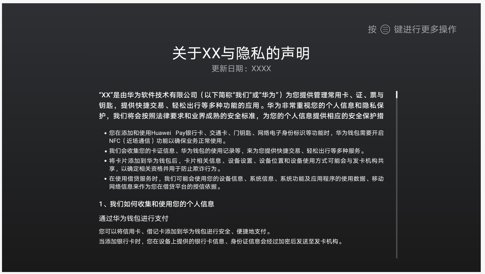
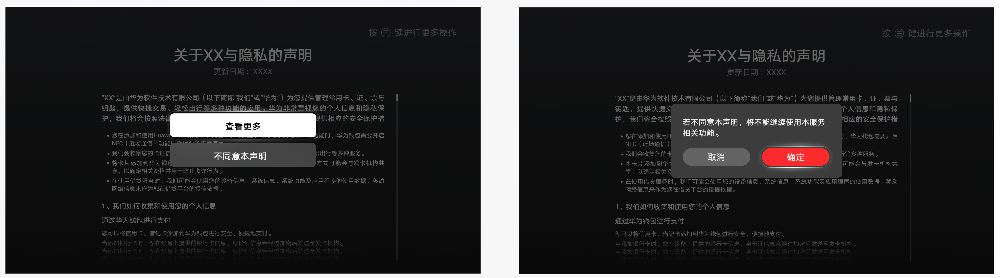

# 隐私保护

## 隐私保护概述

随着互联网及信息化的发展，个人数据在社会经济和日常生活中发挥着越来越重要的作用。与此同时，信息泄露的风险也在增加，消费者产品开发者需要更加有效的保护用户的个人数据，提高用户对产品的信任度。为了提升消费者的隐私体验，产品应默认设置较高级别隐私保护策略，达到保护消费者隐私的目的。

**基本概念**

-   **个人数据（Personal Data）**

    与一个身份已被识别或者身份可被识别的自然人（“数据主体”）相关的任何信息；身份可识别的自然人是指其身份可以通过诸如姓名、身份证号、位置数据等识别码或者通过一个或多个与自然人的身体、生理、精神、经济、文化或者社会身份相关的特定因素来直接或者间接地被识别。个人数据包括：自然人的email地址、电话号码、生物特征（指纹）、位置数据、IP地址、医疗信息、宗教信仰、社保号、婚姻状态等。

-   **敏感个人数据（Sensitive Personal Data）**

    敏感个人数据是个人数据的一个重要子集，指的是涉及数据主体的最私密领域的信息或者一旦泄露可能会给数据主体造成重大不利影响的数据。欧盟等国家和地区法律定义的敏感个人数据包括种族、政治观点、宗教和哲学信仰、工会成员资格、基因数据、生物信息、健康和性生活状况、性取向等。

    根据业界最佳实践，敏感个人数据还包括可与自然人身份相关联的银行卡号、身份证号、护照号、口令等。敏感个人数据的处理需要更多更严格的保护措施。

-   **公开个人数据（Public available Personal Data）**

    数据主体主动公开的个人数据，或公开网页/应用上可访问的个人数据，包括论坛公开的发帖、评论等。

-   **用户画像（User Profile）**

    指对个人数据采取的任何自动化处理的方式，包括评估某个自然人特定方面的情况，尤其是为了分析和预测该自然人的工作表现、经济状况、健康、个人喜好、兴趣、可信度、行为举止、所在位置或行迹。

-   **数据控制者（Data Controller）**

    单独或者与他人共同确定个人数据处理的目的和手段的自然人、法人、公共机构、政府部门或其他机构。

-   **数据处理者（Data Processor）**

    指代表数据控制者处理个人数据的自然人、法人、公共机构、政府部门或其他机构。数据处理者必须按照数据控制者的要求对个人数据进行充分的保护

-   **明示同意（Explicit consent）**

    如下几种情形GDPR法律提到可以通过数据主体明示同意的方式合法地处理数据：

    -   处理敏感个人数据。
    -   自动化决策，包括进行用户画像。
    -   向不具备充分保护水平的国家转移个人数据，并以同意作为合法性基础。

    实现明示同意的方式有：

    -   在隐私声明中用加粗放大的字体展示通知内容，并就该内容单独要求数据主体授予同意。
    -   在收集特定数据时，弹出隐私声明告知个人数据处理相关事项，提供勾选框但不默认勾选，让数据主体勾选“我同意以上述方式处理我的个人数据”，或提供“我同意”的按钮让用户主动点击。
    -   以书面的方式明确表达同意，数据主体在书面陈述上签字。
    -   要求数据主体在系统中上传带有其签名的电子表格。
    -   采取双重验证的方式，要求数据主体邮件形式回复同意后，再次点击用于验证的邮件链接或是输入SMS验证码。
    -   用户主动输入的场景，例如用户主动输入身份证和银行卡号绑卡等场景。

## 数据分类分级

基于数据保护目标及风险后果，即数据遭到泄露或者遭到破坏带来的法律风险对个人、组织或公众的影响对数据进行定级，分为极高、高、中、低、公开五个数据级别。

**表1**  数据分类分级标准

<table><thead align="left"><tr id="zh-cn_topic_0000001051770800_row444844052917"><th class="cellrowborder" valign="top" width="13.239999999999998%" id="mcps1.1.5.1.1">
<strong id="zh-cn_topic_0000001051770800_b17947192114409">数据级别</strong>

</th>
<th class="cellrowborder" valign="top" width="26.05%" id="mcps1.1.5.1.2">
隐私风险

</th>
<th class="cellrowborder" valign="top" width="11.91%" id="mcps1.1.5.1.3">
隐私属性

</th>
<th class="cellrowborder" valign="top" width="48.8%" id="mcps1.1.5.1.4">
<strong id="zh-cn_topic_0000001051770800_b395022119404">典型示例</strong>

</th>
</tr>
</thead>
<tbody><tr id="zh-cn_topic_0000001051770800_row1844904062919"><td class="cellrowborder" valign="top" width="13.239999999999998%" headers="mcps1.1.5.1.1 ">
极高级

</td>
<td class="cellrowborder" valign="top" width="26.05%" headers="mcps1.1.5.1.2 ">
数据一旦识别或关联到特定个人或群体，其泄露或不当使用可能会给个人带来灾难性负面影响。

</td>
<td class="cellrowborder" valign="top" width="11.91%" headers="mcps1.1.5.1.3 ">
敏感个人数据

</td>
<td class="cellrowborder" valign="top" width="48.8%" headers="mcps1.1.5.1.4 ">
DNA、种族、宗教信仰、性取向；生物识别信息（面部识别特征、指纹、声纹等）；原始通信内容；银行卡密码、磁道数据

</td>
</tr>
<tr id="zh-cn_topic_0000001051770800_row8449164062911"><td class="cellrowborder" valign="top" width="13.239999999999998%" headers="mcps1.1.5.1.1 ">
高级别

</td>
<td class="cellrowborder" valign="top" width="26.05%" headers="mcps1.1.5.1.2 ">
数据一旦识别或关联到特定个人或群体，其泄露或不当使用可能会给个人带来严重负面影响。

</td>
<td class="cellrowborder" valign="top" width="11.91%" headers="mcps1.1.5.1.3 ">
敏感个人数据

</td>
<td class="cellrowborder" valign="top" width="48.8%" headers="mcps1.1.5.1.4 ">
权威社会标识（身份证、护照等）；网页浏览记录；轨迹信息；云空间上传的内容数据（图库/音频/视频等）

</td>
</tr>
<tr id="zh-cn_topic_0000001051770800_row1745074020293"><td class="cellrowborder" valign="top" width="13.239999999999998%" headers="mcps1.1.5.1.1 ">
中级别

</td>
<td class="cellrowborder" valign="top" width="26.05%" headers="mcps1.1.5.1.2 ">
数据一旦识别或关联到特定个人或群体，其泄露或不当使用可能会给个人带来重大负面影响。

</td>
<td class="cellrowborder" valign="top" width="11.91%" headers="mcps1.1.5.1.3 ">
一般个人数据

</td>
<td class="cellrowborder" valign="top" width="48.8%" headers="mcps1.1.5.1.4 ">
设备标识（IMEI, SN, OAID ）、用户标识（user ID）；个人基本信息（姓名，地址）；手机号、邮箱等。

</td>
</tr>
<tr id="zh-cn_topic_0000001051770800_row144512407291"><td class="cellrowborder" valign="top" width="13.239999999999998%" headers="mcps1.1.5.1.1 ">
低级别

</td>
<td class="cellrowborder" valign="top" width="26.05%" headers="mcps1.1.5.1.2 ">
数据一旦识别或关联到特定个人或群体，其泄露或不当使用可能会给个人带来有限负面影响。

</td>
<td class="cellrowborder" valign="top" width="11.91%" headers="mcps1.1.5.1.3 ">
一般个人数据

</td>
<td class="cellrowborder" valign="top" width="48.8%" headers="mcps1.1.5.1.4 ">
操作系统设置信息（操作系统版本，国家/地区等）；设备硬件信息（设备型号，屏幕尺寸，屏幕分辨率等）；网络信息（网络连接状态，接入网络信息）；设备状态（登录设备时间/时长）

</td>
</tr>
<tr id="zh-cn_topic_0000001051770800_row135851553268"><td class="cellrowborder" valign="top" width="13.239999999999998%" headers="mcps1.1.5.1.1 ">
公开（无风险）

</td>
<td class="cellrowborder" valign="top" width="26.05%" headers="mcps1.1.5.1.2 ">
对个人或组织无不利影响的可公开数据

</td>
<td class="cellrowborder" valign="top" width="11.91%" headers="mcps1.1.5.1.3 ">
非个人数据

</td>
<td class="cellrowborder" valign="top" width="48.8%" headers="mcps1.1.5.1.4 ">
公开发布的产品介绍，公开的会议信息，外部开源的代码等

</td>
</tr>
</tbody>
</table>

备注：隐私保护和数据分类分级的相关定义参照GDPR中的相关内容。

## 通用隐私设计规则

为了指导厂商完成产品的隐私设计工作，我们整理了以下通用的隐私设计要求，作为OpenHarmony设备厂商产品隐私设计的指南和参考。

**数据收集及使用公开透明**

采集个人数据时，应清晰、明确地告知用户，并确保告知用户的个人信息将被如何使用。

-   针对不同等级的个人数据需要制定针对性的隐私处理策略。
    -   敏感个人数据的采集需要获取数据主体明示同意。
    -   一般个人数据的采集需要数据主体同意或基于其他合法授权。
    -   非个人数据与中、高或极高级别个人数据关联采集，需要数据主体同意或其他合法授权，并在隐私声明中呈现。

-   应制定并遵从适当的隐私政策。在收集、使用留存和第三方分享用户个人数据时需要符合所有适用法律、政策和规定。需充分告知用户处理个人数据的种类、目的、处理方式、保留期限等，满足数据主体权利相关要求。

    根据以上原则，我们设计了正确示例以供参考。隐私通知/声明的参考示例如下：

    **图 1**  隐私通知/声明示例图  
    

-   个人数据应当基于具体、明确、合法的目的收集，不应以与此目的不相符的方式作进一步处理。对于收集目的变更和用户撤销同意后再次重新使用的场景都需要用户重新确认。隐私声明变更和撤销的示例如下图：

    **图 2**  隐私通知/声明变更示例图  
    

    **图 3**  撤销同意示例图  
    

    

    对用户系统软件、应用软件的下载或升级，涉及修改用户隐私空间，用户对于这类行为需要有知情权和控制权，必须给用户提示，并提供给用户同意和取消的选项。

**数据收集及使用最小化**

个人数据收集应与数据处理目的相关，且是适当、必要的。开发者应尽可能对个人数据进行匿名或化名，降低对数据主体的风险。仅可收集和处理与特定目的相关且必需的个人数据，不能进行与特定目的不相关的进一步处理。

-   敏感权限申请的时候要满足权限最小化的要求，在申请权限时，只申请获取必需的信息或资源所需要的权限。
-   数据收集最小化：针对数据的收集要满足最小化要求，不收集与产品提供服务无关联的数据。
-   数据使用的功能要求能够使用户受益，收集的数据不能用于一些与用户正常使用无关的功能。数据收集不能有其他与用户正常使用无关的功能存在。

**数据处理选择和控制**

对个人数据处理必须要征得用户的同意，用户对其个人数据要有充分的控制权。

-   申请获取用户系统权限的授权：产品弹窗提醒，向用户呈现需要获取的权限和权限使用目的、产品需要收集的数据和使用目的等，通过用户点击“确认”的方式完成用户授权，让用户对产品权限的授予和使用透明、可知、可控。
-   用户可以修改、取消授予的权限：当用户不同意某一权限或者数据收集时，应当允许用户使用与这部分权限和数据收集不相关的功能。
-   用户在产品使用过程中，针对录入个人数据的场景，需要给用户提供对个人数据的增加、删除、修改、查看的操作。
-   需要给出硬件回收或返厂进行安全删除个人数据的机制或方法。

**数据安全**

从技术上保证数据处理活动的安全性，包括个人数据的加密存储、安全传输等安全机制，系统应默认开启或采取安全保护措施。

-   对于个人数据的访问需要有保护机制，主要包括身份认证和访问控制。身份认证（如用户名、密码）限定只有经过认证的用户才能访问数据，可应用于多用户场景；访问控制（如权限控制）可应用于对应用程序的限制。
-   分布式设备个人数据安全存储要满足密钥管理和存储服务（HUKS：Huawei Universal Keystore）的要求，包括：秘钥安全存储、数据安全存储。
-   个人数据在分布式设备间传输要满足设备间的信任绑定关系和数据传输通道的安全性要求。
-   认证凭证数据（密码、口令、指纹等）须加密存储。

**本地化处理**

用户数据优先在本设备进行处理，对于本设备无法处理的数据可以考虑使用分布式设备处理或者上传云服务进行处理，并要满足最小化的原则，不能默认选择上传云服务。

**未成年人数据保护要求**

产品专门针对未成年人、或者产品收集用户年龄从而可以识别到是在收集未成年人的个人数据，需结合目标市场国家的法律，专门分析未成年人个人数据保护的问题，收集未成年人数据前需要征得监护人的同意。

## 特殊品类要求

针对消费者硬件产品来说，除了满足以上的通用隐私要求以外，针对特殊品类的产品还有以下的特殊要求，在产品设计过程中参照执行。

**表2**   特殊品类隐私要求

<table><thead align="left"><tr id="zh-cn_topic_0000001051770800_row1943617174010"><th class="cellrowborder" valign="top" width="10.45%" id="mcps1.1.3.1.1">
产品品类

</th>
<th class="cellrowborder" valign="top" width="89.55%" id="mcps1.1.3.1.2">
隐私保护特殊要求

</th>
</tr>
</thead>
<tbody><tr id="zh-cn_topic_0000001051770800_row918893210367"><td class="cellrowborder" valign="top" width="10.45%" headers="mcps1.1.3.1.1 ">
<strong id="zh-cn_topic_0000001051770800_b2550193722316">智能家居</strong>

</td>
<td class="cellrowborder" valign="top" width="89.55%" headers="mcps1.1.3.1.2 ">
安防类产品涉及的指纹、声纹、面部识别、虹膜等个人生物识别信息以及用户密码信息，属于敏感个人数据，应采用技术措施处理后（例如提取个人生物识别信息的摘要）再进行加密保存在产品本地。

</td>
</tr>
<tr id="zh-cn_topic_0000001051770800_row19189103223618"><td class="cellrowborder" valign="top" width="10.45%" headers="mcps1.1.3.1.1 ">
<strong id="zh-cn_topic_0000001051770800_b656417376232">智能家居</strong>

</td>
<td class="cellrowborder" valign="top" width="89.55%" headers="mcps1.1.3.1.2 ">
安防类产品涉及的音视频和图片，设备厂家作为数据控制者时，必须提供独立的隐私通知、应用界面必须有设备厂家品牌标识；音视频数据的传输和存储必须加密，非用户本人访问安防产品的音视频数据，必须获得用户授权。

</td>
</tr>
<tr id="zh-cn_topic_0000001051770800_row121891432163614"><td class="cellrowborder" valign="top" width="10.45%" headers="mcps1.1.3.1.1 ">
<strong id="zh-cn_topic_0000001051770800_b185791737152319">智能家居/影音娱乐</strong>

</td>
<td class="cellrowborder" valign="top" width="89.55%" headers="mcps1.1.3.1.2 ">
建议要求：带有摄像头的产品提供物理上可关闭功能，如通过隐藏、遮盖、转向、指示灯让消费者感知摄像头处于关闭状态。

</td>
</tr>
<tr id="zh-cn_topic_0000001051770800_row1218903210364"><td class="cellrowborder" valign="top" width="10.45%" headers="mcps1.1.3.1.1 ">
<strong id="zh-cn_topic_0000001051770800_b172118112573">智能家居/影音娱乐</strong>

</td>
<td class="cellrowborder" valign="top" width="89.55%" headers="mcps1.1.3.1.2 ">
建议要求：带有麦克风的产品提供显性显示录音的状态，如绿色指示灯显示有数据上传、红色指示灯显示关闭。

</td>
</tr>
<tr id="zh-cn_topic_0000001051770800_row31891932173619"><td class="cellrowborder" valign="top" width="10.45%" headers="mcps1.1.3.1.1 ">
<strong id="zh-cn_topic_0000001051770800_b15811637172310">移动办公</strong>

</td>
<td class="cellrowborder" valign="top" width="89.55%" headers="mcps1.1.3.1.2 ">
用户数据跨设备显示、传输等场景需要给予消费者明示同意的选择权和取消权。

</td>
</tr>
<tr id="zh-cn_topic_0000001051770800_row1189232103617"><td class="cellrowborder" valign="top" width="10.45%" headers="mcps1.1.3.1.1 ">
<strong id="zh-cn_topic_0000001051770800_b65821137162317">车机</strong>

</td>
<td class="cellrowborder" valign="top" width="89.55%" headers="mcps1.1.3.1.2 ">
1、隐私通知及权限设置

避免在驾驶态让用户阅读隐私政策和权限设置。

车机应用需要考虑车辆使用时的安全性，应避免让用户在驾驶过程中进行复杂的权限设置或阅读隐私政策，比如HiCar应用应该在手机端完成应用基本权限设置和隐私政策阅读后再进行使用。

隐私声明在确认用户身份后告知。

车辆的数据会涉及车主、驾驶员和乘客，应保证隐私声明通知到了数据主体本人。建议做法是在确认应用的身份后进行隐私声明，如需要用户登录的应用，应在账号登录后弹出隐私声明而不是账号登录之前。

2、共享应用个人数据保护

共享个人数据的应用在车机重启后应退出，并对当前用户个人数据进行清除或加密，应用还应提供对历史数据进行彻底删除的功能。

3、消息提示

考虑车机的开放环境，应用在车机上进行消息提醒时，必须避免直接将消息内容显示在车机上，正确的做法是仅提示有新的消息需要查看。

</td>
</tr>
</tbody>
</table>

