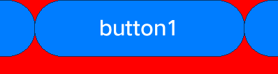

# 布局容器类组件开发指导<a name="ZH-CN_TOPIC_0000001052661991"></a>

布局类容器组件由视图基础类组成，通过直接设置视图位置，可以达到嵌套和重叠布局的目的；通过设置布局类型和边距达到规格化布局子组件的目的；通过调用相关接口可实现根据父组件及兄弟节点布局视图的目的。

## UISwipeView<a name="section13631719181717"></a>

## 使用场景<a name="section11299120102617"></a>

UISwipeView继承UIViewGroup，除提供容器类组件Add、Remove、Insert等方法外还提供按页面滑动功能，滑动结束后当前页面居中对齐显示。该组件分为水平方向和垂直方向，通过Add方法添加的子组件会根据Add的顺序和UISwipeView方向自动水平对齐或则垂直对齐。

## 接口说明<a name="section767434119261"></a>

**表 1**  SwipeView接口说明

<a name="table143378205264"></a>
<table><thead align="left"><tr id="row8336122032615"><th class="cellrowborder" valign="top" width="50%" id="mcps1.2.3.1.1"><p id="p13361520162611"><a name="p13361520162611"></a><a name="p13361520162611"></a>方法</p>
</th>
<th class="cellrowborder" valign="top" width="50%" id="mcps1.2.3.1.2"><p id="p153361920112617"><a name="p153361920112617"></a><a name="p153361920112617"></a>功能</p>
</th>
</tr>
</thead>
<tbody><tr id="row9336720172616"><td class="cellrowborder" valign="top" width="50%" headers="mcps1.2.3.1.1 "><p id="p83365206267"><a name="p83365206267"></a><a name="p83365206267"></a>void SetCurrentPage(uint16_t index);</p>
</td>
<td class="cellrowborder" valign="top" width="50%" headers="mcps1.2.3.1.2 "><p id="p1833612017261"><a name="p1833612017261"></a><a name="p1833612017261"></a>设置当前页</p>
</td>
</tr>
<tr id="row15336172002613"><td class="cellrowborder" valign="top" width="50%" headers="mcps1.2.3.1.1 "><p id="p0336162072613"><a name="p0336162072613"></a><a name="p0336162072613"></a>uint16_t GetCurrentPage()</p>
</td>
<td class="cellrowborder" valign="top" width="50%" headers="mcps1.2.3.1.2 "><p id="p433615207262"><a name="p433615207262"></a><a name="p433615207262"></a>获取当前页</p>
</td>
</tr>
<tr id="row9336920102614"><td class="cellrowborder" valign="top" width="50%" headers="mcps1.2.3.1.1 "><p id="p6336520102619"><a name="p6336520102619"></a><a name="p6336520102619"></a>UIView* GetCurrentView() const</p>
</td>
<td class="cellrowborder" valign="top" width="50%" headers="mcps1.2.3.1.2 "><p id="p16336112062612"><a name="p16336112062612"></a><a name="p16336112062612"></a>获取当前页组件</p>
</td>
</tr>
<tr id="row03371820162616"><td class="cellrowborder" valign="top" width="50%" headers="mcps1.2.3.1.1 "><p id="p7336172082611"><a name="p7336172082611"></a><a name="p7336172082611"></a>void SetOnSwipeListener(OnSwipeListener&amp; onSwipeListener)</p>
</td>
<td class="cellrowborder" valign="top" width="50%" headers="mcps1.2.3.1.2 "><p id="p15336172012269"><a name="p15336172012269"></a><a name="p15336172012269"></a>设置滑动回调类</p>
</td>
</tr>
<tr id="row23371520172613"><td class="cellrowborder" valign="top" width="50%" headers="mcps1.2.3.1.1 "><p id="p733792017267"><a name="p733792017267"></a><a name="p733792017267"></a>void SetAnimatorTime(uint16_t time);</p>
</td>
<td class="cellrowborder" valign="top" width="50%" headers="mcps1.2.3.1.2 "><p id="p16337112012613"><a name="p16337112012613"></a><a name="p16337112012613"></a>设置动画事件</p>
</td>
</tr>
<tr id="row12337152011269"><td class="cellrowborder" valign="top" width="50%" headers="mcps1.2.3.1.1 "><p id="p9337220152610"><a name="p9337220152610"></a><a name="p9337220152610"></a>void SetLoopState(bool loop)</p>
</td>
<td class="cellrowborder" valign="top" width="50%" headers="mcps1.2.3.1.2 "><p id="p12337172032612"><a name="p12337172032612"></a><a name="p12337172032612"></a>设置是否循环</p>
</td>
</tr>
<tr id="row1033713201266"><td class="cellrowborder" valign="top" width="50%" headers="mcps1.2.3.1.1 "><p id="p1933792092610"><a name="p1933792092610"></a><a name="p1933792092610"></a>UIView* GetViewByIndex(uint16_t index);</p>
</td>
<td class="cellrowborder" valign="top" width="50%" headers="mcps1.2.3.1.2 "><p id="p033714208263"><a name="p033714208263"></a><a name="p033714208263"></a>通过index获取view</p>
</td>
</tr>
</tbody>
</table>

## 开发步骤（水平滑动，不可循环）<a name="section111911175287"></a>

1.  创建一个水平滑动的UISwipeView。

    ```
    UISwipeView* swipe = new UISwipeView(UISwipeView::HORIZONTAL);
    ```

2.  向UISwipeView中添加子组件。

    ```
    UILabelButton* button1 = new UILabelButton();
    button1->SetPosition(0, 0, g_ButtonW, g_ButtonH);
    button1->SetText("button1");
    swipe->Add(button1);
    UILabelButton* button2 = new UILabelButton();
    button2->SetPosition(0, 0, g_ButtonW, g_ButtonH);
    button2->SetText("button2");
    swipe->Add(button2);
    UILabelButton* button3 = new UILabelButton();
    button3->SetPosition(0, 0, g_ButtonW, g_ButtonH);
    button3->SetText("button3");
    swipe->Add(button3);
    ```

3.  检查实现效果，水平滑动，不可循环。

    **图 1**  UISwipeView水平滑动效果图<a name="fig933862020262"></a>  
    

    


## 开发步骤（水平滑动，可循环）<a name="section1976914915282"></a>

1.  创建一个水平滑动的UISwipeView并添加子组件。

    ```
    UISwipeView* swipe = new UISwipeView(UISwipeView::HORIZONTAL);
    UILabelButton* button1 = new UILabelButton();
    button1->SetPosition(0, 0, g_ButtonW, g_ButtonH);
    button1->SetText("button1");
    swipe->Add(button1);
    UILabelButton* button2 = new UILabelButton();
    button2->SetPosition(0, 0, g_ButtonW, g_ButtonH);
    button2->SetText("button2");
    swipe->Add(button2);
    UILabelButton* button3 = new UILabelButton();
    button3->SetPosition(0, 0, g_ButtonW, g_ButtonH);
    button3->SetText("button3");
    swipe->Add(button3);
    ```

2.  设置UISwipeView循环滑动。

    ```
    swipe->SetLoopState(true);
    ```

3.  检查实现效果，水平循环滑动。

    **图 2**  UISwipeView水平滑动循环效果图<a name="fig1533902042618"></a>  
    

    


## GridLayout<a name="section46819199173"></a>

## 使用场景<a name="section831618247294"></a>

提供基础布局能力，可设置网格行数和列数，通过Add方法添加的子组件在调用LayoutChildren\(\)方法后自动进行排列布局。

## 接口说明<a name="section597214622912"></a>

**表 2**  GridLayout接口说明

<a name="table109971146192913"></a>
<table><thead align="left"><tr id="row9997104632911"><th class="cellrowborder" valign="top" width="50%" id="mcps1.2.3.1.1"><p id="p119971146192917"><a name="p119971146192917"></a><a name="p119971146192917"></a>方法</p>
</th>
<th class="cellrowborder" valign="top" width="50%" id="mcps1.2.3.1.2"><p id="p7997204615291"><a name="p7997204615291"></a><a name="p7997204615291"></a>功能</p>
</th>
</tr>
</thead>
<tbody><tr id="row149976467292"><td class="cellrowborder" valign="top" width="50%" headers="mcps1.2.3.1.1 "><p id="p159971046102912"><a name="p159971046102912"></a><a name="p159971046102912"></a>void SetRows(const uint16_t&amp; rows)</p>
</td>
<td class="cellrowborder" valign="top" width="50%" headers="mcps1.2.3.1.2 "><p id="p14997846132913"><a name="p14997846132913"></a><a name="p14997846132913"></a>设置行数</p>
</td>
</tr>
<tr id="row299774652915"><td class="cellrowborder" valign="top" width="50%" headers="mcps1.2.3.1.1 "><p id="p099744615296"><a name="p099744615296"></a><a name="p099744615296"></a>void SetCols(const uint16_t&amp; cols)</p>
</td>
<td class="cellrowborder" valign="top" width="50%" headers="mcps1.2.3.1.2 "><p id="p19971646142910"><a name="p19971646142910"></a><a name="p19971646142910"></a>设置列数</p>
</td>
</tr>
<tr id="row1199724616291"><td class="cellrowborder" valign="top" width="50%" headers="mcps1.2.3.1.1 "><p id="p18997846202912"><a name="p18997846202912"></a><a name="p18997846202912"></a>void LayoutChildren(bool needInvalidate = false)</p>
</td>
<td class="cellrowborder" valign="top" width="50%" headers="mcps1.2.3.1.2 "><p id="p1997174618291"><a name="p1997174618291"></a><a name="p1997174618291"></a>布局子组件</p>
</td>
</tr>
</tbody>
</table>

## 开发步骤<a name="section1418253410306"></a>

1.  构造GridLayout并设置位置、大小信息。

    ```
    GridLayout* layout_ = new GridLayout();
    layout_->SetPosition(0, g_y, HROIZONTAL_RESOLUTION, 200);
    layout_->SetLayoutDirection(LAYOUT_HOR);
    layout_->SetRows(2);
    layout_->SetCols(2);
    ```

2.  构造子组件button。

    ```
    UILabelButton* bt1 = new UILabelButton();
    bt1->SetPosition(0,0,100,50);
    bt1->SetText("bt1");
    UILabelButton* bt2 = new UILabelButton();
    bt2->SetPosition(0, 0, 100, 50);
    bt2->SetText("bt2");
    UILabelButton* bt3 = new UILabelButton();
    bt3->SetPosition(0, 0, 100, 50);
    bt3->SetText("bt3");
    UILabelButton* bt4 = new UILabelButton();
    bt4->SetPosition(0, 0, 100, 50);
    bt4->SetText("bt4");
    ```

3.  添加子组件并调用LayoutChildren\(\)。

    ```
    layout_->Add(bt1);
    layout_->Add(bt2);
    layout_->Add(bt3);
    layout_->Add(bt4);
    layout_->LayoutChildren();
    ```

4.  检查button组件布局效果如下图所示。

    **图 3**  设置2\*2网格并添加4个button组件进行布局<a name="fig898719135314"></a>  
    


