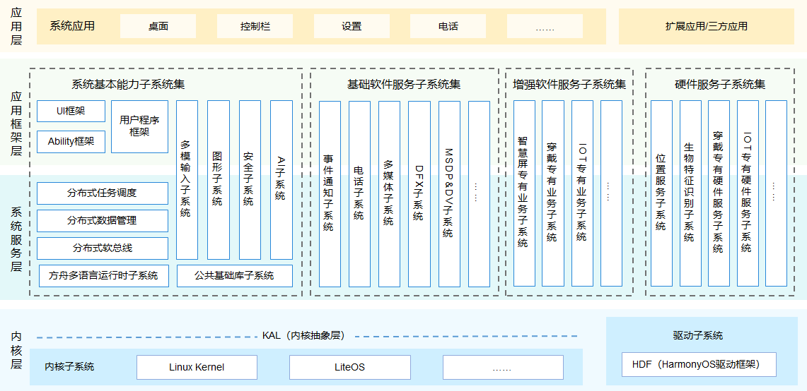
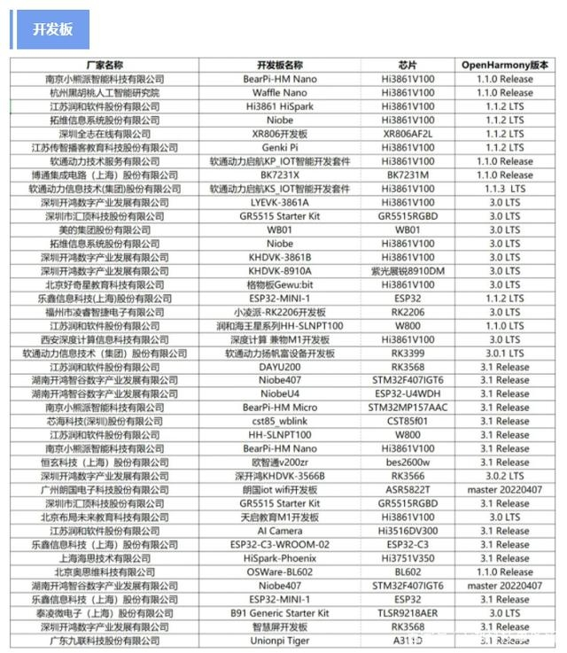
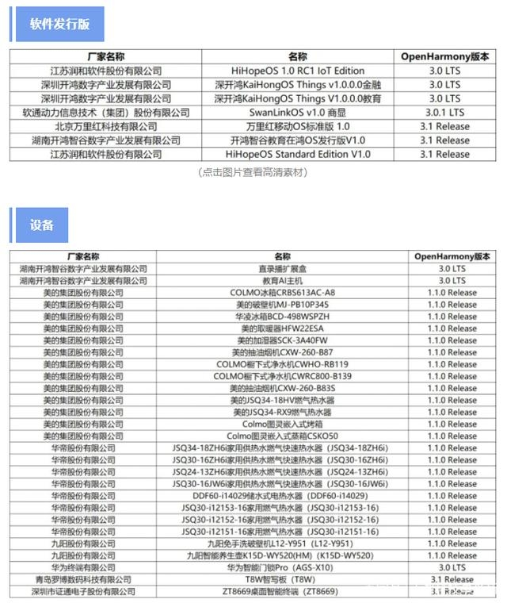

# 鸿蒙HarmonyOS、开源鸿蒙系统OpenHarmony分布式操作系统

华为鸿蒙分布式操作系统（Huawei OpenHarmony），开源鸿蒙系统（OpenHarmony）分布式操作系统开发技术交流，鸿蒙技术资料，手册，指南，共建万物互联新生态。

  

================鸿蒙系统简介================

  
鸿蒙OS分布式操作系统简介
`鸿蒙系统（HarmonyOS）`，是第一款基于微内核的全场景分布式OS，是华为自主研发的操作系统。2019年8月9日，鸿蒙系统在华为开发者大会`<HDC.2019>`上正式发布，华为会率先部署在智慧屏、车载终端、穿戴等智能终端上，未来会有越来越多的智能设备使用开源的`鸿蒙OS`。2020年9月10日,在华为开发者大会2020上,华为消费者业务CEO余承东发布鸿蒙系统HarmonyOS 2.0，计划12月份支持手机，2021发布带鸿蒙OS的华为手机，平板等所有设备。

`鸿蒙OS`实现模块化耦合，对应不同设备可弹性部署，`鸿蒙OS`有三层架构，第一层是内核，第二层是基础服务，第三层是程序框架 。可用于大屏、PC、汽车等各种不同的设备上。还可以随时用在手机，平板上。

`鸿蒙 OS` 底层由鸿蒙微内核、Linux 内核、Lite OS 组成，未来将发展为完全的鸿蒙微内核架构。

鸿蒙2.0的开源主要分为三个阶段：

1、9⽉10⽇起，HarmonyOS将⾯向智慧屏、可穿戴设备、⻋机等RAM在128KB-128MB终端设备开放源代码，
2020年12⽉⾸先向开发者发布⼿机HarmonyOS 2.0开发者Beta版本，提供开发环境、⼯具、模拟器和开发⽂档；

2、2021年4⽉底前，向RAM在128MB-4GB终端设备，包括平板、低内存⼿机等开源，并在适当时候发布商⽤版本；

3、鸿蒙系统 2.0 6 月 2 号陆续开源 L2 分支，无安卓代码的纯鸿蒙系统，手机内核基于Linux4.19版本，只支持纯鸿蒙的应用。
同时发布L3-L5是双框架版本，开发者公测的Beta3版本，支持运行纯鸿蒙应用，也支持运行所有的Android应用。

4、2021年10⽉以后⾯向4GB以上所有设备开源。

5、OpenHarmonyOS为开放原子开源基金会（OpenAtom Foundation）旗下开源项目，由华为捐赠核心架构源码，任何个人和组织可以基于开源协议开发或定制系统，包括商用，无需缴纳专利费用。

6、HarmonyOS是华为基于开放原子开源基金会（OpenAtom Foundation）旗下开源OpenHarmonyOS项目开发的发行版本，目前支持华为和荣耀系列，兼容安卓APP。

7、2021年9月12日，余承东宣布鸿蒙系统用户升级超过1亿用户，成为全球破亿最快的移动操作系统。

8、发布应用于采矿行业的操作系统矿鸿，鸿蒙生态体系延伸到工业，农业等传统产业。

9、2021年10月22日，HDC2021华为开发者大会，余承东宣布鸿蒙系统用户升级超过1.5亿用户，成为全球发展最快的移动操作系统。

10、2021年10月27日， Eclipse基金会推出基于OpenHarmony的新物联网操作系统Oniro OS。

11、2022年5月，鸿蒙系统掌舵人王成录从华为离职，加盟深开鸿，引领开源鸿蒙生态

12、2022年8月，中国电信天翼物联宣布正式加入OpenHarmony（“开源鸿蒙”）社区，并主导成立智慧城市蜂窝终端管理SIG （Special Interest Group，又称“特别兴趣小组”），填补了中国电信在开源物联网终端操作系统生态领域的空白。中国电信也成为首个加入OpenHarmony开源社区的运营商。

13、2022年9月，工信部：鸿蒙操作系统装机量已超3亿台，从工业和信息化部20日举行的“大力发展新一代信息技术产业”新闻发布会获悉，近年来工信部大力支持操作系统发展。在服务器操作系统方面，推动服务器操作系统与主流CPU、数据库等软硬件的兼容适配，加快提高产品的国际竞争力，其中欧拉操作系统终端部署量超过170万套；在移动操作系统方面，支持骨干企业开展核心技术攻关，加快移动操作系统应用推广，其中鸿蒙操作系统装机量已超过3亿台。

14、2022年9月，华为首款鸿蒙家庭存储正式发布，2TB+2TB：2999.00，8TB+8TB：4999.00。

15、2022年10月，在工业和信息化部政府服务平台官网，华为终端有限公司申请入网了一款“5G数字移动电话机”，设备型号为NOH-AN80。

16、2022年11月，搭载HarmonyOS的华为设备已超过3.2亿，鸿蒙智联已有合作伙伴超过2200家，产品发货量超过2.5亿，全球鸿蒙生态开发者超过200万，HarmonyOS原子化服务多达5万个。

17、2023年1月，据统计鸿蒙系统的设备用户量已经超过了5.7亿。华为鸿蒙系统手机全球份额已经达到2%，已占据移动操作系统一席之地。成为全球第三大移动操作系统，正式开始与谷歌安卓、苹果iOS三分天下。74个华为设备接收到鸿蒙系统3稳定更新。包括P20系列、Mate 10系列、享系列等。

18、2023年4月，华为宣布了HarmonyOS 3的路线图，包括约150个旧设备。截至2023年4月，已有超过100个设备安装了稳定版HarmonyOS 3，另有39个设备仍在进行Beta测试。这是HarmonyOS 3的一项重大成就，所有这些设备平台现在都可以享受HarmonyOS带来的最新特性。包括智能手机、平板电脑、智能手表、音频设备和智能电视。

19、2023年，鸿蒙系统生态系统发展，华为和美团宣布合作开发鸿蒙系统原生应用。截至2023年8月，鸿蒙系统生态系统拥有超过7亿设备，超过220万开发者支持。

20、2023年，鸿蒙系统全球扩展，华为计划到2023年在20亿设备上安装鸿蒙系统。鸿蒙系统连接和OpenHarmony在这一增长中贡献巨大。

21、2023年，鸿蒙系统3.1版本，宣布了鸿蒙系统3.1版本，重点是ArkTS开发语言，API数量超过10,000个。

22、2023年，鸿蒙系统3升级计划，发布了2023年计划接收鸿蒙系统3更新的设备列表，包括华为P30系列、Mate 20系列和多款享系列机型。

23、2023年9月，鸿蒙之父王成录回答网友关于PC版鸿蒙的提问时，只回复了一个「有」字，让人满怀期待。鸿蒙PC操作系统可能将于2024年发布，引领一场新的PC革命，值得期待。

24、2023年11月，鸿蒙系统宣布下一代Next系统不再支持安卓，网易，美团开出4-6万月薪招聘鸿蒙工程师。

25、2023年12月20，开源鸿蒙开发者手机在装配工厂下线。

26、2023年12月26日报道，从华为内部人士了解到，除手机鸿蒙之外，PC端的鸿蒙操作系统已经接近完成（21财经），可以预测2024年华为将发布鸿蒙PC操作系统，鸿蒙将成为Windows，Linux，macOS后的第四大操作系统，相关的生态发展对开发者都是一个大的机会。

27、华为宣布，将在2024年1月18日，在北京、上海、杭州、南京、成都、厦门、武汉、长沙 8 大城市同时召开大会。届时将揭秘鸿蒙生态和 HarmonyOS NEXT 进阶新篇章。新系统业内简称“纯血鸿蒙”，目前鸿蒙用户4.5亿。开源鸿蒙PC操作系统已经内测，2024年将正式发布。

28、2024年1月18日，华为常务董事、终端BG CEO余承东表示，鸿蒙生态设备数已到到8亿台+。发布原生HarmonyOS NEXT鸿蒙星河版操作系统，面向开发者全面开放申请。目前，首批200+鸿蒙原生应用已启动开发，包括便捷生活、出行文旅、金融理财 、社交资讯、生产力工具、影音娱乐、游戏等领域。

29、2024年6月21，华为开发者大会（HDC 2024）于6月21日至23日在东莞松山湖举行，主要聚焦于HarmonyOS NEXT全场景智能操作系统的发布和未来规划。发布全新的纯血鸿蒙HarmonyOS NEXT，支持鸿蒙原生智能全系列Ai生态。小艺升级为小艺智能体，实现意图交互框架。支持星盾安全架构，重新定义隐私安全，支持生态纯净（从源头构建新秩序），隐私可控（从权限到管数据），数据高安（从个人安全到协同安全），禁止开发九类不合理权限，每次访问允许，只单允许，分享转发实现系统级授权，只有指定的用户才能查看，转发无效。支持全局未成年人模式，一键切换所有数据内容为青少年内容。获得行业最高等级安全等级认证，鸿蒙内核 CC EAL 6+，HarmonyOS Next IP产品信息安全认证证书评估保障级（EAL）。余承东发文五年前8月9日，HarmonyOS重磅登场，1778天以来，经历4次重磅系统迭代，鸿蒙生态拥用了9亿多台设备、超过254万开发者，5000多个常用应用已全部启动开发。做有底座，有生态，真正的智能操作系统。

30、2024年6月21日发表仓颉编程语言。

仓颉编程语言白皮书
https://developer.huawei.com/consumer/cn/doc/openharmony-cangjie/cj-wp-abstract

仓颉编程语言开发指南
https://developer.huawei.com/consumer/cn/doc/openharmony-cangjie/89_u7f16_u7a0b_u8bed_u8a00_u5f00_u53d1_u6307_u5357

仓颉编程语言语言规约
https://developer.huawei.com/consumer/cn/doc/openharmony-cangjie/cj-lan-spec

仓颉编程语言库 API
https://developer.huawei.com/consumer/cn/doc/openharmony-cangjie/libs_overview_ohos

31、鸿蒙生态列表
开发版厂商

  

设备、软件发行版厂商

  

================鸿蒙系统简介================

================鸿蒙OS开发社区================

开放原子基金会鸿蒙OpenHarmonyOS官方代码仓库：
https://openharmony.gitee.com/

华为发行版鸿蒙HarmonyOS官方代码下载库：
https://repo.huaweicloud.com/harmonyos/os/

鸿蒙HarmonyOS 1.1.0LTS版本
https://repo.huaweicloud.com/harmonyos/os/1.1.0/code-1.1.0.tar.gz

鸿蒙HarmonyOS2.0 Canary版本
https://repo.huaweicloud.com/harmonyos/os/2.0/code-2.0-canary.tar.gz

鸿蒙HarmonyOS 1.1.2LTS版本
https://repo.huaweicloud.com/harmonyos/os/1.1.2/code-v1.1.2-LTS.tar.gz

鸿蒙HarmonyOS2.2 Beta2版本
https://repo.huaweicloud.com/harmonyos/os/2.2-Beta2/code-v2.2-beta2_20210730.tar.gz
https://repo.huaweicloud.com/harmonyos/os/2.2-Beta2/standard-2.2-Beta2.tar.gz

鸿蒙HarmonyOS 1.1.3LTS版本
https://repo.huaweicloud.com/harmonyos/os/1.1.3/code-v1.1.3-LTS.tar.gz

鸿蒙HarmonyOS 3.0LTS版本
https://repo.huaweicloud.com/harmonyos/os/3.0/code-v3.0-LTS.tar.gz

鸿蒙HarmonyOS 3.0 standard版本
https://repo.huaweicloud.com/harmonyos/os/3.0/standard.tar.gz

鸿蒙OS2.0尝鲜体验入口指南
https://mp.weixin.qq.com/s/GyClqZp4PoAroKteFuf3Wg

OpenHarmony 教育资源仓已于 2021 年 5 月在 Gitee（码云）平台正式启用
https://gitee.com/openatom-university/openharmony-oer

鸿蒙OS开发者Beta公测招募：截止日期2021年4月30日
https://developer.huawei.com/consumer/cn/activity/301607581257578636/signup

华为开发者联盟官方论坛：
https://developer.huawei.com/consumer

博客园华为开发者论坛
https://www.cnblogs.com/developer-huawei/

鸿蒙开发初探
https://zhuanlan.zhihu.com/p/384499498

鸿蒙NDK开发
http://t.zoukankan.com/zjutzz-p-13855758.html

成为华为鸿蒙OS开发者，应该学习什么编程语言？
https://zhuanlan.zhihu.com/p/382898719

鸿蒙os吧
https://tieba.baidu.com/f?kw=鸿蒙os&ie=utf-8

鸿蒙官网
https://www.harmonyos.com

OpenHarmony 网站
国内用户访问: https://www.openharmony.cn

海外用户访问:https://www.openharmony.io

OpenHarmony SIG 组织地址
https://gitee.com/openharmony-sig

OpenHarmony开发样例
https://growing.openharmony.cn/

OpenHarmony 三方库组织地址
https://gitee.com/openharmony-tpc

OpenHarmony 在线交流平台
https://zulip.openharmony.cn/

OpenHarmony 社区贡献指南
https://gitee.com/openharmony/docs/blob/master/zh-cn/contribute/%E5%8F%82%E4%B8%8E%E8%B4%A1%E7%8C%AE.md

OpenHarmony Dev 邮件列表
dev@openharmony.io

openatom订阅链接
https://lists.openatom.io/postorius/lists/dev.openharmony.io/

鸿蒙开发者官网：
https://developer.harmonyos.com

鸿蒙开发IDE：Deveco studio
https://developer.harmonyos.com/cn/develop/deveco-studio

方舟编译器官网：
https://www.openarkcompiler.cn

ARK方舟编译器开源代码官方主仓库:
提高安卓系统操作的流畅性24%，响应速度44%，第三方应用的流畅性高达60%。
https://gitee.com/openarkcompiler/OpenArkCompiler

华为LiteOS：
https://github.com/LiteOS/LiteOS

开发工具Huawei LiteOS Studio：
https://static.huaweicloud.com/upload/files/sdk/LiteOS_IDE.zip

华为主题开发，华为手表主题设计（如太空人），手机主题设计
https://developer.huawei.com/consumer/cn/huaweithemes

鸿蒙生态合作企业：润和软件
http://www.hihope.org/index.aspx

开发刷机经验参考
https://www.cnblogs.com/xusw/p/13757614.html

https://developer.51cto.com/art/202102/647152.htm

Mate30Pro5G版刷机包下载链接
https://it360.org.cn/view/7828?continueFlag=5ca4b2015aedda218954371fe98d8ee8

华为开发者学院
https://developer.huawei.com/consumer/cn/training/

鸿蒙学堂
https://hmxt.org

鸿蒙研究站
百文说内核｜百万注源码｜百图画鸿蒙
http://www.weharmonyos.com

华为鸿蒙 HarmonyOS 开发资料全面汇总
https://segmentfault.com/a/1190000040594200

鸿蒙 (操作系统)wiki
https://zh.wikipedia.org/wiki/%E9%B8%BF%E8%92%99_(%E6%93%8D%E4%BD%9C%E7%B3%BB%E7%BB%9F)

OpenHarmony Wiki
https://zh.wikipedia.org/wiki/OpenHarmony

w3cschool鸿蒙文档
https://www.w3cschool.cn/harmonyos/

鸿蒙技术社区
https://bbs.elecfans.com/harmonyos

https://harmonyos.51cto.com

https://www.oschina.net/group/harmonyos

鸿蒙海思最全芯片资料
百度云盘链接: https://pan.baidu.com/s/1tLjthBQzmqYOqmdIzRClvw  密码: 3s18

操作系统内核巩固系列资料
http://www.oldlinux.org

第一款编译器，贝尔实验室出品
https://github.com/pavel-krivanek/legacy-cc

https://github.com/mortdeus/legacy-cc

经典操作系统学习windows xp sp1源码
百度云盘链接: https://pan.baidu.com/s/1BL3tyXVtf7XwJ6gYSbXFXw  密码: q8rj

贝尔实验室鼻祖级操作系统Plan9
https://github.com/brho/plan9

https://github.com/Earnestly/plan9

算法基础：数据结构算法动态可视化
https://algorithm-visualizer.org

https://visualgo.net/

优秀电子硬件设计博客网站
https://www.mr-wu.cn

免费的计算机编程类中文书籍
https://github.com/justjavac/free-programming-books-zh_CN

================鸿蒙OS开发社区================

================鸿蒙OS开发板================

润和社区 http://www.hihope.org/

鸿蒙开发板：
1、HarmonyOS HiSpark AI Camera 支持OpenHarmony（Hi3516）
https://item.taobao.com/item.htm?spm=a1z10.3-c.w4002-18447093278.18.46a24c57weAWXH&id=622922688823

2、HarmonyOS HiSpark IPC DIY 摄像头 支持OpenHarmony（Hi3518）
https://item.taobao.com/item.htm?spm=a1z10.3-c.w4002-18447093278.21.46a24c57weAWXH&id=623376454933

3、HarmonyOS HiSpark Wi-Fi IoT智能家居开发套件 支持OpenHarmony（Hi3861）
https://item.taobao.com/item.htm?spm=a1z10.3-c.w4002-18447093278.24.46a24c57weAWXH&id=622343426064

4、最便宜的鸿蒙开发版：Neptune HarmonyOS物联网 IOT模组，Wi-Fi&蓝牙双模模块，开发板
https://item.taobao.com/item.htm?spm=a1z10.5-c-s.w4002-21152782427.26.410945fbVVmXcb&id=635868903111

深开鸿
https://www.kaihong.com/products/KaihongOS

Opengharymony共建样例
https://growing.openharmony.cn/

================鸿蒙OS开发板================

================鸿蒙SIG兴趣组================

https://www.openharmony.cn/sig

================鸿蒙SIG兴趣组================

================鸿蒙OS核心文档================

# OpenHarmony开发者文档

此工程存放OpenHarmony提供的快速入门、开发指南、API参考等开发者文档，欢迎参与OpenHarmony开发者文档开源项目，与我们一起完善开发者文档。

[View English](Openharmony%20v1.0/docs-en/Readme-EN.md)

## 文档目录结构

-   quick-start：[快速入门](Openharmony%20v1.0/docs/quick-start/Readme-CN.md)
-   get-code：[获取源码/获取工具](Openharmony%20v1.0/docs/get-code/Readme-CN.md)
-   driver：[驱动](Openharmony%20v1.0/docs/driver/Readme-CN.md)
-   kernel：[内核](Openharmony%20v1.0/docs/kernel/Readme-CN.md)
-   subsystems：[子系统](Openharmony%20v1.0/docs/subsystems/Readme-CN.md)
-   bundles：[组件开发](Openharmony%20v1.0/docs/bundles/Readme-CN.md)
-   guide：[设备开发](Openharmony%20v1.0/docs/guide/Readme-CN.md)
-   security：[安全](Openharmony%20v1.0/docs/security/Readme-CN.md)
-   api-LinkIoT：[联接类模组API](Openharmony%20v1.0/api/api-LinkIoT/Readme-CN.md)
-   api-SmartVision-Devices：[智慧视觉设备API](Openharmony%20v1.0/api/api-SmartVision-Devices/Readme-CN.md)
-   contribute：[贡献](Openharmony%20v1.0/docs/contribute/参与贡献.md)
-   term：[术语](Openharmony%20v1.0/docs/term/术语.md)

## 贡献

非常欢迎您贡献文档，我们鼓励开发者以各种方式参与文档反馈和贡献。

您可以对现有文档进行评价、简单更改、反馈文档质量问题、贡献您的原创内容，详细请参考[贡献文档](Openharmony%20v1.0/docs/contribute/贡献文档.md)。

卓越贡献者将会在开发者社区文档贡献专栏表彰公示。

================鸿蒙OS核心文档================

=================深度交流==================

      核心技术是独立自主出来的

================分微矩阵社区================

	
	
	[分微开源鸿蒙社区]
 	智联网开发者交流知识星球：人工智能AGI开发者联盟   https://t.zsxq.com/2Nj6UnY 
	鸿蒙开发者联盟QQ交流群1:184548177
	鸿蒙开发者联盟QQ交流群2:374825209
	
	
	[分微社区公众号官网]
	微信公众号(fenwii-tec)：分微科技
	Github: https://github.com/fenwii
	Gitee: https://gitee.com/samir
	
	[分微技术社区]
	头条，抖音： ChatGPT中国应用社区
	AGI人工智能中国知识星球：AGI人工智能中国社区 https://t.zsxq.com/0af53ee8J
	编程技术交流知识星球：C语言C++汇编研究中心   https://t.zsxq.com/jeYVJuj

  

  

================分微矩阵社区================

=================深度交流==================

# Star History

